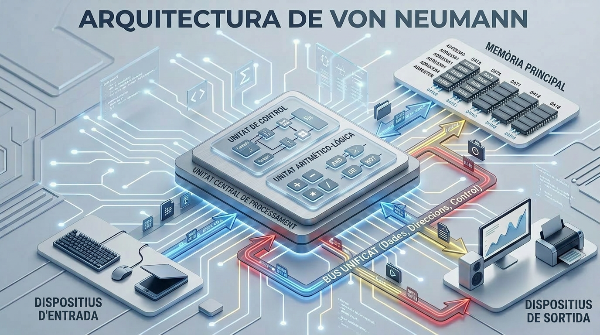

## 1.1. Ordinadors moderns

Un **ordinador** pot definir-se com un dispositiu capaç d'executar, de manera automàtica, ràpida i repetible, seqüències d'instruccions aplicades sobre dades. L'estudi de la seva organització interna resulta fonamental per comprendre les raons per les quals els programes adopten determinades estructures i per què certes operacions impliquen un cost computacional més elevat que d'altres.

Els ordinadors moderns són sistemes heterogenis optimitzats per al rendiment, l'eficiència energètica i la connectivitat, amb arquitectures multinucli (CPU), acceleradors de propòsit específic (GPUs, NPUs), memòria RAM ràpida, emmagatzematge NVMe, i fortes capes de seguretat i virtualització.

Un ordinador executa programes llegint una seqüència d'instruccions emmagatzemades en memòria i processant-les de manera ordenada per la Unitat Central de Processament (CPU, *Central Processing Unit* en anglès), que repeteix contínuament un cicle bàsic:

- primer cerca la instrucció,
- després la interpreta per saber quina operació ha de realitzar,
- tot seguit l'executa sobre dades que poden estar en registres, caché o memòria RAM, i
- finalment desa el resultat si cal.

Per fer-ho amb rapidesa, el processador utilitza components interns com la unitat de control, que coordina els senyals, la Unitat Aritmètica i Lògica (ALU, *Arithmetic Logic Unit* en anglès), que realitza càlculs i operacions lògiques, i una jerarquia de memòria que intenta apropar al màxim les dades que s'utilitzen amb més freqüència. En la pràctica, mentre un programa s'executa, la CPU va avançant instrucció per instrucció, prenent decisions, movent dades i coordinant la interacció amb altres dispositius, fins a completar la tasca que el programa defineix.

La descripció anterior del funcionament de l'ordinador es basa principalment en l'arquitectura de von Neumann. En aquest model, la CPU executa instruccions emmagatzemades en memòria seguint un cicle seqüencial de cerca, descodificació i execució, amb una mateixa memòria per a dades i instruccions. En els ordinadors moderns, aquesta idea continua sent la base conceptual, tot i que sol aparèixer combinada amb trets de Harvard modificada, com ara cachés separades per a instruccions i dades, per millorar el rendiment.

### Arquitectures d'ordinadors

#### Arquitectura de Von Neumann

La majoria dels ordinadors moderns es basen en el model proposat el 1945 per John
von Neumann, que estableix que **instruccions i dades comparteixen el mateix espai de
memòria** [@vonneumann1945].

{#fig-von-neumann width=90%}

::: {#imp-von-neumann .callout-important title="Arquitectura de Von Neumann"}
L'arquitectura de Von Neumann organitza l'ordinador en quatre components principals
interconnectats per un **bus**:

- **Unitat Central de Procés (CPU)**: executa instruccions.
- **Memòria principal (RAM)**: emmagatzema instruccions i dades en ús.
- **Unitats d'entrada/sortida**: teclat, pantalla, disc, xarxa.
- **Bus del sistema**: canal de comunicació entre els components.

El cicle fonamental és: *capturar instrucció → descodificar-la → executar-la* (cicle
Fetch-Decode-Execute).
:::

En l'arquitectura de von Neumann, instruccions i dades comparteixen una mateixa memòria i, per tant, també solen compartir el mateix camí d'accés. El funcionament es basa en el cicle d'instrucció: la CPU pren una instrucció de memòria, la interpreta, l'executa i després passa a la següent. Aquest model és conceptualment senzill i continua sent la base de molts sistemes actuals, tot i que presenta l'anomenat **coll d'ampolla de von Neumann**, ja que l'accés seqüencial a una memòria compartida limita el rendiment quan la CPU necessita instruccions i dades al mateix temps.

#### Arquitectura Harvard modificada

L'**arquitectura Harvard modificada** és una variant de l'arquitectura Harvard que manté separades les memòries o busos d'instruccions i dades, però permet que el contingut de la memòria d'instruccions pugui llegir-se també com a dades. Això combina la velocitat de l'accés paral·lel amb una flexibilitat més gran que la Harvard pura, i per això apareix en molts processadors moderns, especialment en microcontroladors i DSP (*Digital Signal Processor*).

En els ordinadors actuals, el model teòric es complementa amb una jerarquia de memòria: registres, caché L1/L2/L3, RAM i emmagatzematge secundari. La CPU intenta treballar primer amb la informació més propera i ràpida, perquè accedir a la RAM o al SSD és molt més costós en temps. Per això, tot i que l'ordinador continuï recolzant-se en la lògica de von Neumann o Harvard modificada, en la pràctica el rendiment depèn de l'organització del subsistema de memòria i de la capacitat del processador per explotar el paral·lelisme intern.

### Tipus d'ordinadors

Des d'una perspectiva classificatòria, els ordinadors poden estudiar-se segons la seva capacitat de processament, la seva finalitat o el seu grau de portabilitat. Aquesta tipologia resulta útil per comprendre tant l'evolució històrica de la informàtica com l'especialització actual dels sistemes computacionals.

En l'àmbit universitari, convé distingir entre sistemes de propòsit general, capaços d'executar múltiples aplicacions, i sistemes de propòsit específic, dissenyats per a una funció concreta. Aquesta distinció permet interpretar millor la diversitat de dispositius informàtics contemporanis i la seva inserció en contextos acadèmics, empresarials i industrials.

| Tipus d'ordinador | Definició | Característiques principals | Usos habituals |
|---|---|---|---|
| Superordinador | Sistema informàtic d'altíssima capacitat de processament, dissenyat per executar operacions complexes en paral·lel. | Gran potència de càlcul, arquitectura massivament paral·lela, elevat consum energètic i alt cost. | Simulació científica, meteorologia, intel·ligència artificial, modelatge físic i criptografia. |
| Mainframe | Ordinador de gran escala orientat al tractament massiu de dades i a la gestió simultània de múltiples usuaris. | Alta fiabilitat, disponibilitat contínua, gran capacitat d'E/S i forta tolerància a fallades. | Banca, administració pública, assegurances, telecomunicacions i grans corporacions. |
| Servidor | Equip dedicat a proporcionar serveis, recursos o dades a altres ordinadors dins d'una xarxa. | Estabilitat, escalabilitat, capacitat d'emmagatzematge i processament sostingut. | Allotjament web, bases de dades, virtualització, correu electrònic i arxius compartits. |
| Estació de treball | Ordinador d'alt rendiment destinat a tasques tècniques o científiques que exigeixen gran capacitat de còmput i gràfics. | Processadors potents, memòria abundant, GPU dedicada i components d'alta qualitat. | Disseny assistit per ordinador, modelatge 3D, edició audiovisual, simulació i recerca. |
| Ordinador de sobretaula | Sistema informàtic fix, generalment modular i ampliable, pensat per a ús general. | Bon equilibri entre rendiment, cost i capacitat d'ampliació. | Ús domèstic, ofimàtica, programació, educació i videojocs. |
| Ordinador portàtil | Equip compacte i integrat que combina pantalla, teclat, bateria i sistema de processament en un sol dispositiu. | Alta portabilitat, autonomia energètica i menor capacitat d'ampliació que un sobretaula. | Treball mòbil, docència, estudi i ús professional itinerant. |
| Mini PC | Ordinador de mida reduïda amb baix consum i prestacions variables segons la configuració. | Format compacte, eficiència energètica i ocupació mínima d'espai. | Entorns d'oficina, centres multimèdia, laboratoris i aplicacions embegudes. |
| Tauleta | Dispositiu portàtil amb interfície tàctil, concebut per a la interacció directa amb l'usuari. | Lleugeresa, mobilitat, simplicitat d'ús i dependència de pantalla tàctil. | Lectura, anotació, docència, navegació web i consum multimèdia. |
| Smartphone | Dispositiu mòbil de propòsit general que integra funcions de telefonia, computació i connectivitat avançada. | Gran integració de sensors, connectivitat permanent i elevada portabilitat. | Comunicació, aplicacions mòbils, navegació, fotografia i productivitat bàsica. |
| Wearable | Dispositiu electrònic vestible que s'incorpora al cos o a la vestimenta. | Mida reduïda, sensors integrats i funcionament complementari a altres dispositius. | Monitoratge d'activitat física, salut, notificacions i assistència contextual. |

La classificació de la taula anterior mostra que la noció d'ordinador abasta des de grans sistemes de càlcul científic fins a dispositius personals altament portàtils. En conseqüència, l'elecció d'un tipus o un altre depèn de variables com rendiment, cost, mobilitat, fiabilitat i àmbit d'aplicació.

### Components d'un ordinador

La taula següent resumeix els components principals d'un ordinador modern incloent-hi exemples actuals de gamma comuna/alta.

| Component | Funció | Tipus actuals / exemples |
|---|---|---|
| Processador (CPU) | Executa instruccions i coordina el sistema. | Intel Core i9, Intel Core Ultra, AMD Ryzen 9, Apple M-series. |
| Placa base | Connecta i comunica tots els components. | Chipsets amb suport per a DDR5, PCIe 4.0/5.0, M.2 NVMe, USB-C/USB4, Wi‑Fi 6E/7. |
| Memòria RAM | Manté dades i instruccions d'ús immediat. | DDR5, i en alguns equips encara DDR4; en portàtils també LPDDR5/LPDDR5X. |
| Emmagatzematge | Desa sistema, programes i arxius. | SSD NVMe M.2, SSD SATA, HDD per a arxius massius. |
| Targeta gràfica (GPU) | Accelera gràfics i còmput paral·lel. | NVIDIA GeForce RTX, AMD Radeon RX, i iGPU integrades en CPU modernes. |
| Font d'alimentació | Subministra energia a l'equip. | Fonts ATX de 80 Plus Bronze/Gold/Platinum, segons potència i eficiència. |
| Refrigeració | Dissipa calor i manté estabilitat. | Dissipadors per aire, AIO líquida, ventiladors PWM d'alt flux. |
| Caixa o xassís | Allotja i protegeix els components. | ATX, microATX, Mini-ITX, torres compactes i mini-PC. |
| Xarxa i connectivitat | Permet accés a Internet i perifèrics. | Ethernet Gigabit/2.5G/10G, Wi‑Fi 6/6E/7, Bluetooth, USB-C. |

**Processador (CPU)**: les seves característiques clau són la freqüència de rellotge (GHz), el nombre de nuclis i la quantitat de caché.

**Memòria d'Accés Aleatori (RAM, *Random Access Memory* en anglès)**: emmagatzematge temporal i ràpid que conté el sistema operatiu, els programes en execució i les dades actives. En apagar l'ordinador, el seu contingut es perd.

**Emmagatzematge**: les unitats d'estat sòlid (SSD NVMe, *Solid State Drive* en anglès) són avui l'estàndard. Desen el sistema operatiu, els programes i els arxius de manera permanent. Són entre 10 i 100 vegades més ràpides que les unitats de disc dur (HDD, *Hard Disk Drive* en anglès) tradicionals.

**Targeta gràfica (GPU, *Graphics Processing Unit* en anglès)**: imprescindible per a l'entrenament de models d'aprenentatge profund.

::: {.callout-tip appearance="simple" title="Consell: Quin ordinador comprar?"}
**Per a aquest curs, qualsevol portàtil modern és més que suficient, ja que el treball
computacionalment intensiu es realitza als servidors de GitHub Codespaces.**

No obstant això, si voleu tenir un ordinador per treballar localment, la taula següent
presenta tres configuracions segons el pressupost disponible:

| Nivell | CPU | RAM | Emmagatzematge | Gràfica | Ús recomanat |
|---|---|---:|---|---|---|
| Barat | Intel Core i3 / Ryzen 3 o equivalent, 2 nuclis / 4 fils | 8 GB | SSD SATA de 256 GB | Integrada | Programació bàsica en Python, exercicis, scripts petits, VS Code amb poques extensions. |
| Equilibrat | Intel Core i5 / Ryzen 5 o equivalent, 4 a 6 nuclis | 16 GB | SSD NVMe de 512 GB | Integrada | Estudi còmode, diversos projectes oberts, navegador + VS Code + terminal sense massa lentitud. |
| Ideal | Intel Core i7 / Core Ultra 7 / Ryzen 7 o equivalent, 8 nuclis o més | 16 a 32 GB | SSD NVMe d'1 TB | Integrada o dedicada lleugera | Treball fluid amb projectes grans, Jupyter, anàlisi de dades, Docker lleuger i multitasca intensa. |

**Sistema operatiu**: Windows 10/11, macOS 12 o posterior, o qualsevol distribució
Linux moderna. Els tres són completament compatibles amb les eines del curs.
:::

Per aprofundir en l'arquitectura d'ordinadors, consulteu el clàssic
*Computer Organization and Design* [@pattersonhennessy2021], disponible a la
biblioteca de la UIB.

---

## 1.2. Llenguatges de programació i Python

### Llenguatges d'alt nivell

Els ordinadors només comprenen el [**llenguatge de màquina**](https://ca.wikipedia.org/wiki/Llenguatge_de_m%C3%A0quina){target="_blank" rel="noopener noreferrer"}: seqüències de zeros i uns
específiques per a cada arquitectura. Escriure directament en codi màquina és inviable
per a projectes reals. Els **llenguatges d'alt nivell** resolen això: permeten expressar
algorismes de manera llegible, propera al llenguatge matemàtic o natural, abstraient els
detalls del maquinari.

::: {#imp-programa .callout-important title="Programa"}
Un **programa** és una descripció precisa i sense ambigüitats d'un procés
computacional, escrita en un llenguatge formal. A diferència del llenguatge natural, no
pot contenir instruccions vagues o contradictòries: l'ordinador executa exactament
el que se li indica, ni més ni menys.
:::

### Compilació vs. interpretació

Perquè el codi font en alt nivell sigui executable, s'ha de transformar en
instruccions que el processador comprengui (llenguatge de màquina). Hi ha dues estratègies principals:

::: {#imp-compilacion-interpretacion .callout-important title="Compilar vs. Interpretar"}
- **Compilació**: el codi font es tradueix íntegrament a codi màquina *abans* d'executar-se.
  El resultat és un fitxer executable independent. Exemples: C, C++, Fortran, Rust.
- **Interpretació**: el codi es llegeix i s'executa *línia a línia* en temps d'execució
  per un programa anomenat intèrpret. No es genera cap executable independent.
  Exemples: Python, R, Ruby.
- **Models híbrids**: alguns llenguatges compilen a un [*bytecode*](https://ca.wikipedia.org/wiki/Bytecode){target="_blank" rel="noopener noreferrer"} intermedi que després
  executa una màquina virtual. Exemples: Java (JVM), Python (CPython).
:::

| Característica | Compilat | Interpretat |
| :--- | :--- | :--- |
| Velocitat d'execució | Alta | Menor |
| Portabilitat de l'executable | Baixa (depèn del SO/arquitectura) | Alta (l'intèrpret és portable) |
| Cicle de desenvolupament | Més lent (compilar → executar) | Més ràpid (executar directament) |
| Detecció d'errors | En temps de compilació | En temps d'execució |

### El llenguatge Python

Python va ser creat per Guido van Rossum i publicat el 1991. Avui és el llenguatge més
utilitzat en ciència de dades, intel·ligència artificial i computació científica, i un
dels més populars en educació.

::: {#imp-python .callout-important title="Python"}
Python és un llenguatge d'alt nivell, **interpretat**, de tipatge dinàmic i amb una
sintaxi dissenyada per afavorir la llegibilitat. La seva filosofia es resumeix en el
*Zen de Python* [@pythonpep20]: *explícit és millor que implícit; simple és millor que
complex; la llegibilitat compta*.

```python
import this  # mostra el Zen de Python a l'intèrpret
```
:::

Les seves característiques més rellevants per a aquest curs són la sintaxi neta (no fa servir
claus ni punt i coma), el tipatge dinàmic (les variables no declaren el seu tipus), l'ecosistema
científic madur (NumPy, Matplotlib, SymPy, pandas) i la integració nativa amb
eines d'IA.

#### L'intèrpret interactiu: Python REPL

Una de les característiques més útils de Python és el seu **intèrpret interactiu**, conegut com a **REPL** (*Read-Eval-Print Loop*): llegeix una expressió, l'avalua, n'imprimeix el resultat i espera la següent. S'hi accedeix escrivint `python` al terminal.

```python
>>> 2 ** 10          # potència de 2
1024
>>> import math
>>> math.sqrt(2)     # arrel quadrada de 2
1.4142135623730951
>>> sum(range(1, 101))   # suma de l'1 al 100
5050
```

::: {.callout-tip appearance="simple" title="Consell"}
El REPL és ideal per experimentar: provar una expressió, verificar el comportament d'una
funció o explorar una biblioteca sense necessitat de crear un fitxer. Els matemàtics el
troben especialment natural —és la calculadora científica més potent que existeix— i és
l'eina perfecta per donar els primers passos amb Python.

El REPL no desa el codi entre sessions. En tancar el terminal, tot el que heu escrit es
perd. Per conservar la feina, escriviu-la en un fitxer `.py` o en un quadern Jupyter o
Marimo. En aquest curs fareu servir principalment fitxers `.py` des de VS Code i Codespaces.
:::

Vegeu la documentació oficial de Python a [@python3docs]. És la referència més fiable i
s'actualitza amb cada versió del llenguatge.

---

## 1.3. IDEs moderns

Un **IDE** (*Integrated Development Environment* en anglès o Entorn de Desenvolupament Integrat en català) és una aplicació que integra en una sola interfície les eines necessàries per escriure, executar i depurar programes.

### Característiques comunes

Els IDEs moderns comparteixen un conjunt de funcionalitats essencials:

- **Ressaltat de sintaxi**: coloreja paraules clau, cadenes i comentaris per
  facilitar la lectura.
- **Autocompletat**: suggereix noms de variables, funcions i mètodes mentre s'escriu.
- **Depurador integrat** (*debugger*): permet executar el programa pas a pas,
  inspeccionar el valor de les variables i establir punts de ruptura (*breakpoints*).
- **Terminal integrat**: accés a la línia d'ordres sense sortir de l'entorn.
- **Control de versions**: integració amb Git per registrar canvis en el codi.
- **Sistema d'extensions**: permet afegir suport per a nous llenguatges,
  eines i serveis.

::: {.callout-tip appearance="simple" title="Consell"}
El depurador integrat és una de les eines més infrautilitzades pels programadors
principiants. Aprendre a fer-lo servir des del principi —en lloc de dependre exclusivament
de `print`— accelera significativament la detecció i correcció d'errors.
:::

### Locals vs. el núvol

Els entorns de desenvolupament poden executar-se **localment** a l'ordinador del
programador o **al núvol** en servidors remots accessibles des del navegador.

#### Visual Studio Code (local)

**Visual Studio Code** (VS Code) és un editor de codi lleuger, extensible i gratuït
desenvolupat per Microsoft, el més utilitzat en l'actualitat [@vscode_docs]. Quan s'instal·la
localment, Python i totes les extensions resideixen a l'ordinador del desenvolupador.

La interfície s'organitza en:

- **Barra lateral esquerra**: explorador d'arxius, cerca, Git i extensions.
- **Editor central**: àrea d'escriptura de codi amb múltiples pestanyes.
- **Terminal integrat**: consola per executar programes i ordres del sistema.

{#fig-vscode width=90%}

La documentació oficial de VS Code es pot consultar a [@vscode_docs].

#### Visual Studio Code a GitHub Codespaces

**GitHub Codespaces** proporciona VS Code completament configurat i executant-se en
servidors de Microsoft al núvol, accessible des de qualsevol navegador sense instal·lar
res a l'ordinador local [@codespaces_docs].

::: {#imp-codespaces .callout-important title="Codespace"}
Un Codespace és un contenidor de desenvolupament (*dev container*) allotjat al núvol que
inclou el sistema operatiu, l'intèrpret de Python, les biblioteques i les extensions
preconfigurades. El programador només necessita un navegador i un **compte de GitHub**.
:::

**Avantatges per a aquest curs:**

- Entorn idèntic per a tots els estudiants, eliminant problemes de configuració.
- El codi es desa al núvol mitjançant Git.
- Accessible des de qualsevol dispositiu i sistema operatiu.

::: {.callout-warning title="Atenció"}
A l'[Exercici 1](../exercicis/tema1.qmd) posareu en pràctica l'arrencada del vostre
primer Codespace.

Tanqueu el Codespace en acabar la sessió per no consumir les hores gratuïtes del pla
educatiu: `Ctrl+Shift+P` → *Codespaces: Stop Current Codespace*.
:::

La documentació de GitHub Codespaces es pot consultar a [@codespaces_docs].

---

## 1.4. Programació assistida per IA

La incorporació de la intel·ligència artificial al flux de treball del programador és
un dels canvis més significatius dels últims anys. Comprendre aquestes eines
—i els seus límits— és avui part de la formació de qualsevol programador.

### Models de Llenguatge Grans (LLMs)

::: {#imp-llm .callout-important title="LLM"}
Un **LLM** (*Large Language Model*, Model de Llenguatge Gran) és un sistema d'intel·ligència
artificial entrenat amb enormes volums de text —incloent-hi codi font, documentació i fòrums
tècnics— per predir la continuació més probable d'una seqüència de paraules o tokens. La seva
capacitat per generar text coherent i contextalment rellevant sorgeix de l'aprenentatge
estadístic sobre milers de milions de paràmetres.
:::

Els LLMs aplicats a codi no "comprenen" la lògica del programa en el sentit
matemàtic: generen codi *plausible* basant-se en patrons apresos. Això explica
tant les seves impressionants capacitats com les seves fallades inesperades.

::: {.callout-note appearance="minimal" collapse="true" title="Aprofundiment"}
L'arquitectura que subjau als LLMs moderns és el **Transformer**, introduït el
2017 a l'article *Attention Is All You Need* [@vaswani2017]. El mecanisme clau, l'*atenció*,
permet al model relacionar qualsevol parell de paraules en una seqüència
independentment de la seva distància.
:::

### Assistents d'IA de codi

Un **assistent de codi** (*coding assistant* o *copilot*) és una eina d'IA integrada en l'entorn de
desenvolupament que ajuda el programador durant l'escriptura del codi. A diferència d'un cercador
o un chatbot genèric, l'assistent de codi té accés al fitxer que s'està editant, al context del
projecte i a l'historial recent de canvis, la qual cosa li permet oferir suggeriments precisos
i rellevants.

::: {#imp-coding-assistant .callout-important title="Assistent de codi"}
Un **assistent de codi** combina un LLM especialitzat en programació amb integració directa
en l'IDE. Actua en dues modalitats principals:

- **Autocompletat en línia**: suggereix la continuació del codi mentre el programador escriu,
  sense interrompre el flux de treball.
- **Xat integrat**: respon preguntes sobre el codi, explica errors, refactoritza fragments i
  genera implementacions a partir d'una descripció en llenguatge natural.
:::

#### GitHub Copilot

GitHub Copilot és un assistent de codi basat en LLM desenvolupat per GitHub i
OpenAI, integrat directament a VS Code i Codespaces [@copilot_docs]. Suggereix
completacions de codi en temps real, genera funcions a partir de comentaris i
respon preguntes sobre el codi en un xat integrat.

**Què pot fer Copilot?**

- Completar codi a partir del context (nom de funció, comentari, docstring).
- Generar una primera implementació a partir d'una descripció.
- Explicar què fa un fragment de codi.
- Detectar errors i suggerir correccions.
- Generar casos de prova.

::: {.callout-warning title="Atenció"}
Copilot genera codi *plausible*, no codi *verificat*. Pot produir solucions
incorrectes, ineficients o amb errors subtils que passen desapercebuts. En aquest curs
el cicle de treball és sempre **especificar → generar → verificar**: primer es defineix
amb precisió què ha de fer el codi, després es genera (amb o sense IA), i finalment
es comprova sistemàticament que fa el que ha de fer.
:::

La documentació oficial de GitHub Copilot es pot consultar a [@copilot_docs].

### Vibe Coding

El terme **vibe coding** va ser encunyat per Andrej Karpathy el febrer de 2025 per
descriure una forma de programar en la qual el desenvolupador delega gairebé per complet
l'escriptura del codi a l'assistent d'IA, interactuant amb ell principalment en llenguatge
natural i integrant el codi generat sense revisar-lo en profunditat [@karpathy2025].

::: {.callout-warning title="Atenció"}
El vibe coding pot ser productiu per crear prototips ràpids o explorar idees. No
obstant això, delegar l'escriptura del codi sense comprendre'l condueix inevitablement a
sistemes fràgils, difícils de corregir i de mantenir. **En aquest curs el vibe coding
no és una pràctica acceptable**: l'estudiant ha de ser capaç d'explicar, justificar i
modificar qualsevol línia que lliuri, independentment de com s'hagi generat.
:::

La distinció entre ús productiu i vibe coding és conceptualment la mateixa que existeix
entre usar una calculadora comprenent les matemàtiques i usar-la sense saber quina
operació realitzar. La IA amplifica la capacitat del programador competent; no
reemplaça la competència que encara no existeix.

### Agents de desenvolupament autònoms

Els **agents de desenvolupament autònoms** (*coding agents*) són sistemes d'IA capaços de
descompondre tasques de programació complexes en subtasques, executar codi, llegir la
sortida, corregir errors i repetir el cicle de manera autònoma, amb mínima intervenció
humana.

::: {#imp-coding-agents .callout-important title="Coding Agent"}
Un **coding agent** combina un LLM amb la capacitat d'usar eines: executar
ordres en un terminal, llegir i escriure fitxers, cercar a internet i cridar APIs.
L'agent planifica, actua i corregeix la seva pròpia feina en un bucle autònom.
:::

Exemples representatius el 2025–2026:

| Agent | Desenvolupador | Descripció |
| :--- | :--- | :--- |
| [Devin](https://www.cognition.ai/){target="_blank" rel="noopener noreferrer"} | Cognition AI | Primer agent d'enginyeria de programari autònom; pot planificar, implementar i depurar projectes complets. |
| [GitHub Copilot Workspace](https://githubnext.com/projects/copilot-workspace){target="_blank" rel="noopener noreferrer"} | GitHub / Microsoft | Agent integrat a GitHub que transforma issues en implementacions completes dins del repositori. |
| [Cursor Agent](https://www.cursor.com/){target="_blank" rel="noopener noreferrer"} | Anysphere | IDE basat en VS Code amb agent que pot editar múltiples fitxers, executar codi i corregir errors en bucle. |
| [Windsurf](https://codeium.com/windsurf){target="_blank" rel="noopener noreferrer"} | Codeium | IDE amb agent (*Cascade*) que manté consciència del context complet del projecte i actua de manera proactiva. |
| [Claude Code](https://www.anthropic.com/claude-code){target="_blank" rel="noopener noreferrer"} | Anthropic | Agent de línia d'ordres que entén bases de codi completes i executa tasques d'enginyeria end-to-end. |
| [Codex CLI](https://openai.com/codex){target="_blank" rel="noopener noreferrer"} | OpenAI | Agent de línia d'ordres que executa tasques de programació en un entorn segur (*sandbox*), amb accés a terminal, fitxers i internet. |
| [Tongyi Lingma](https://tongyi.aliyun.com/lingma){target="_blank" rel="noopener noreferrer"} | Alibaba Cloud | Assistent de codi basat en els models Qwen; integrat a VS Code i JetBrains, amb capacitats de xat i completat en línia. |
| [Baidu Comate](https://comate.baidu.com/){target="_blank" rel="noopener noreferrer"} | Baidu | Assistent de codi basat en ERNIE; extensió per a VS Code i JetBrains amb generació, explicació i revisió de codi. |
| [MarsCode](https://www.marscode.com/){target="_blank" rel="noopener noreferrer"} | ByteDance | IDE al núvol (basat en VS Code) amb agent integrat basat en els models Doubao; orientat al desenvolupament col·laboratiu. |
| [CodeGeeX](https://codegeex.cn/){target="_blank" rel="noopener noreferrer"} | Zhipu AI / Tsinghua | Model de codi obert desenvolupat a la Universitat de Tsinghua; extensió per a VS Code amb completat i xat multilingüe. |

Aquests sistemes representen l'estat de l'art actual, però presenten limitacions
importants: poden acumular errors silenciosament, són difícils d'auditar i
requereixen que el programador humà mantingui el criteri sobre què construir i com
verificar-ho. L'ordre d'aparició dels agents a la taula no indica qualitat ni rendiment: cada un té fortaleses i debilitats diferents.

## Bibliografia {.unnumbered}

::: {#refs}
:::
