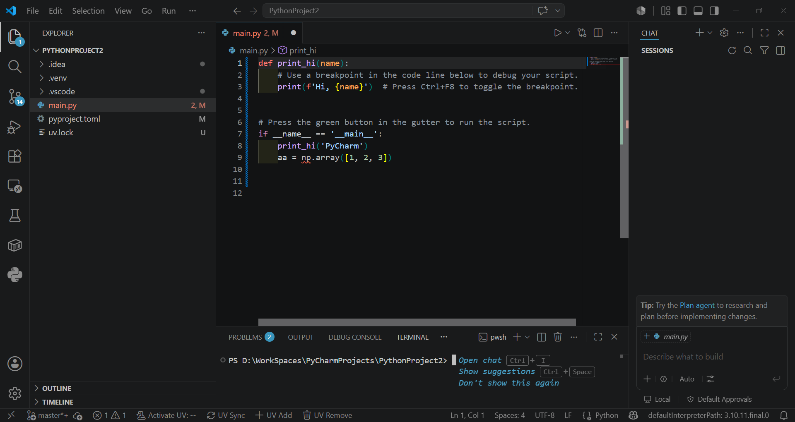

## 1.1. Ordenadores modernos

Un **ordenador** puede definirse como un dispositivo capaz de ejecutar, de manera automática, rápida y repetible, secuencias de instrucciones aplicadas sobre datos. El estudio de su organización interna resulta fundamental para comprender las razones por las cuales los programas adoptan determinadas estructuras y por qué ciertas operaciones implican un mayor coste computacional que otras.

Los ordenadores modernos son sistemas heterogéneos optimizados para rendimiento, eficiencia energética y conectividad, con arquitecturas multinúcleo (CPU), aceleradores de propósito específico (GPUs, NPUs), memoria RAM rápida, almacenamiento NVMe, y fuertes capas de seguridad y virtualización.

Un ordenador ejecuta programas leyendo una secuencia de instrucciones almacenadas en memoria y procesándolas de forma ordenada por la Unidad Central de Procesamiento (CPU, Central Processing Unit en inglés), que repite continuamente un ciclo básico: 

- primero busca la instrucción, 
- después la interpreta para saber qué operación debe realizar, 
- luego la ejecuta sobre datos que pueden estar en registros, caché o memoria RAM, y
- finalmente guarda el resultado si es necesario. 

Para hacerlo con rapidez, el procesador utiliza componentes internos como la unidad de control, que coordina las señales, la Unidad Aritmético-Lógica (ALU, Arithmetic Logic Unit en inglés), que realiza cálculos y operaciones lógicas, y una jerarquía de memoria que intenta acercar al máximo los datos que se usan con más frecuencia. En la práctica, mientras un programa se ejecuta, la CPU va avanzando instrucción por instrucción, tomando decisiones, moviendo datos y coordinando la interacción con otros dispositivos, hasta completar la tarea que el programa define.

La descripción anterior del funcionamiento del ordenador se basa principalmente en la arquitectura de von Neumann. En ese modelo, la CPU ejecuta instrucciones almacenadas en memoria siguiendo un ciclo secuencial de búsqueda, decodificación y ejecución, con una misma memoria para datos e instrucciones. En los ordenadores modernos, esa idea sigue siendo la base conceptual, aunque suele aparecer combinada con rasgos de Harvard modificada, como cachés separadas para instrucciones y datos, para mejorar el rendimiento.

### Arquitecturas de ordenadores

#### Arquitectura de Von Neumann

La mayoría de los ordenadores modernos se basan en el modelo propuesto en 1945 por John
von Neumann, que establece que **instrucciones y datos comparten el mismo espacio de
memoria** [@vonneumann1945].

{#fig-von-neumann width=90%}

::: {#imp-von-neumann .callout-important title="Arquitectura de Von Neumann"}
La arquitectura de Von Neumann organiza el ordenador en cuatro componentes principales
interconectados por un **bus**:

- **Unidad Central de Proceso (CPU)**: ejecuta instrucciones.
- **Memoria principal (RAM)**: almacena instrucciones y datos en uso.
- **Unidades de entrada/salida**: teclado, pantalla, disco, red.
- **Bus del sistema**: canal de comunicación entre los componentes.

El ciclo fundamental es: *capturar instrucción → decodificarla → ejecutarla* (ciclo
Fetch-Decode-Execute).
:::

En la arquitectura de von Neumann, instrucciones y datos comparten una misma memoria y, por tanto, también suelen compartir el mismo camino de acceso. El funcionamiento se basa en el ciclo de instrucción: la CPU toma una instrucción de memoria, la interpreta, la ejecuta y después pasa a la siguiente. Este modelo es conceptualmente sencillo y sigue siendo la base de muchos sistemas actuales, aunque presenta el llamado **cuello de botella de von Neumann**, ya que el acceso secuencial a una memoria compartida limita el rendimiento cuando la CPU necesita instrucciones y datos al mismo tiempo.

#### Arquitectura Harvard modificada

La **arquitectura Harvard modificada** es una variante de la arquitectura Harvard que mantiene separadas las memorias o buses de instrucciones y datos, pero permite que el contenido de la memoria de instrucciones pueda leerse también como datos. Esto combina la velocidad del acceso paralelo con una flexibilidad mayor que la Harvard pura, y por eso aparece en muchos procesadores modernos, especialmente en microcontroladores y DSP (Digital Signal Processor).

En los ordenadores actuales, el modelo teórico se complementa con una jerarquía de memoria: registros, caché L1/L2/L3, RAM y almacenamiento secundario. La CPU intenta trabajar primero con la información más cercana y rápida, porque acceder a la RAM o al SSD es mucho más costoso en tiempo. Por eso, aunque el ordenador siga apoyándose en la lógica de von Neumann o Harvard modificada, en la práctica el rendimiento depende de la organización del subsistema de memoria y de la capacidad del procesador para explotar paralelismo interno.

### Tipos de ordenadores

Desde una perspectiva clasificatoria, los ordenadores pueden estudiarse según su capacidad de procesamiento, su finalidad o su grado de portabilidad. Esta tipología resulta útil para comprender tanto la evolución histórica de la informática como la especialización actual de los sistemas computacionales.

En el ámbito universitario, conviene distinguir entre sistemas de propósito general, capaces de ejecutar múltiples aplicaciones, y sistemas de propósito específico, diseñados para una función concreta. Esta distinción permite interpretar mejor la diversidad de dispositivos informáticos contemporáneos y su inserción en contextos académicos, empresariales e industriales.

| Tipo de ordenador | Definición | Características principales | Usos habituales |
|---|---|---|---|
| Supercomputadora | Sistema informático de altísima capacidad de procesamiento, diseñado para ejecutar operaciones complejas en paralelo. | Gran potencia de cálculo, arquitectura masivamente paralela, elevado consumo energético y alto coste. | Simulación científica, meteorología, inteligencia artificial, modelado físico y criptografía. |
| Mainframe | Ordenador de gran escala orientado al tratamiento masivo de datos y a la gestión simultánea de múltiples usuarios. | Alta fiabilidad, disponibilidad continua, gran capacidad de E/S y fuerte tolerancia a fallos. | Banca, administración pública, seguros, telecomunicaciones y grandes corporaciones. |
| Servidor | Equipo dedicado a proporcionar servicios, recursos o datos a otros ordenadores dentro de una red. | Estabilidad, escalabilidad, capacidad de almacenamiento y procesamiento sostenido. | Alojamiento web, bases de datos, virtualización, correo electrónico y archivos compartidos. |
| Estación de trabajo | Ordenador de alto rendimiento destinado a tareas técnicas o científicas que exigen gran capacidad de cómputo y gráficos. | Procesadores potentes, memoria abundante, GPU dedicada y componentes de alta calidad. | Diseño asistido por computadora, modelado 3D, edición audiovisual, simulación e investigación. |
| Ordenador de sobremesa | Sistema informático fijo, generalmente modular y ampliable, pensado para uso general. | Buen equilibrio entre rendimiento, coste y capacidad de ampliación. | Uso doméstico, ofimática, programación, educación y videojuegos. |
| Ordenador portátil | Equipo compacto e integrado que combina pantalla, teclado, batería y sistema de procesamiento en un solo dispositivo. | Alta portabilidad, autonomía energética y menor capacidad de ampliación que un sobremesa. | Trabajo móvil, docencia, estudio y uso profesional itinerante. |
| Mini PC | Ordenador de tamaño reducido con bajo consumo y prestaciones variables según la configuración. | Formato compacto, eficiencia energética y ocupación mínima de espacio. | Entornos de oficina, centros multimedia, laboratorios y aplicaciones embebidas. |
| Tableta | Dispositivo portátil con interfaz táctil, concebido para la interacción directa con el usuario. | Ligereza, movilidad, simplicidad de uso y dependencia de pantalla táctil. | Lectura, anotación, docencia, navegación web y consumo multimedia. |
| Smartphone | Dispositivo móvil de propósito general que integra funciones de telefonía, computación y conectividad avanzada. | Gran integración de sensores, conectividad permanente y elevada portabilidad. | Comunicación, aplicaciones móviles, navegación, fotografía y productividad básica. |
| Wearable | Dispositivo electrónico vestible que se incorpora al cuerpo o a la vestimenta. | Tamaño reducido, sensores integrados y funcionamiento complementario a otros dispositivos. | Monitorización de actividad física, salud, notificaciones y asistencia contextual. |

La clasificación en la tabla anterior muestra que la noción de ordenador abarca desde grandes sistemas de cálculo científico hasta dispositivos personales altamente portátiles. En consecuencia, la elección de un tipo u otro depende de variables como rendimiento, coste, movilidad, fiabilidad y ámbito de aplicación.

### Componentes de un ordenador

La siguiente tabla resume los componentes principales de un ordenador moderno incluyendo ejemplos actuales de gama común/alta.

| Componente | Función | Tipos actuales / ejemplos |
|---|---|---|
| Procesador (CPU) | Ejecuta instrucciones y coordina el sistema. | Intel Core i9, Intel Core Ultra, AMD Ryzen 9, Apple M-series. |
| Placa base | Conecta y comunica todos los componentes. | Chipsets con soporte para DDR5, PCIe 4.0/5.0, M.2 NVMe, USB-C/USB4, Wi‑Fi 6E/7. |
| Memoria RAM | Mantiene datos e instrucciones de uso inmediato. | DDR5, y en algunos equipos todavía DDR4; en portátiles también LPDDR5/LPDDR5X. |
| Almacenamiento | Guarda sistema, programas y archivos. | SSD NVMe M.2, SSD SATA, HDD para archivos masivos. |
| Tarjeta gráfica (GPU) | Acelera gráficos y cómputo paralelo. | NVIDIA GeForce RTX, AMD Radeon RX, e iGPU integradas en CPU modernas. |
| Fuente de alimentación | Suministra energía al equipo. | Fuentes ATX de 80 Plus Bronze/Gold/Platinum, según potencia y eficiencia. |
| Refrigeración | Disipa calor y mantiene estabilidad. | Disipadores por aire, AIO líquida, ventiladores PWM de alto flujo. |
| Caja o chasis | Aloja y protege los componentes. | ATX, microATX, Mini-ITX, torres compactas y mini-PC. |
| Red y conectividad | Permite acceso a Internet y periféricos. | Ethernet Gigabit/2.5G/10G, Wi‑Fi 6/6E/7, Bluetooth, USB-C. |

**Procesador (CPU)**: sus características clave son la frecuencia de reloj (GHz), el número de núcleos y la cantidad de caché.

**Memoria de Acceso Aleatorio (RAM, Random Access Memory en inglés)**: almacenamiento temporal y rápido que contiene el sistema operativo, los programas en ejecución y los datos activos. Al apagar el ordenador, su contenido se pierde.

**Almacenamiento**: las unidades de estado sólido (SSD NVMe, Solid State Drive en inglés) son hoy el estándar. Guardan el sistema operativo, los programas y los archivos de forma permanente. Son entre 10 y 100 veces más rápidos que las unidades de disco duro (HDD, Hard Disk Drive en inglés) tradicionales.

**Tarjeta gráfica (GPU, Graphics Processing Unit en inglés)**: imprescindible para el entrenamiento de modelos de aprendizaje profundo. 

::: {.callout-tip appearance="simple" title="Consejo: ¿Qué ordenador comprar?"}
**Para este curso, cualquier portátil moderno es más que suficiente, ya que el trabajo
computacionalmente intensivo se realiza en los servidores de GitHub Codespaces.** 

No obstante, si desea tener un ordenador para trabajar localmente, la siguiente tabla presenta tres configuraciones según presupuesto disponible:

| Nivel | CPU | RAM | Almacenamiento | Gráfica | Uso recomendado |
|---|---|---:|---|---|---|
| Barata | Intel Core i3 / Ryzen 3 o equivalente, 2 núcleos / 4 hilos | 8 GB | SSD SATA de 256 GB | Integrada | Programación básica en Python, ejercicios, scripts pequeños, VS Code con pocas extensiones. |
| Equilibrada | Intel Core i5 / Ryzen 5 o equivalente, 4 a 6 núcleos | 16 GB | SSD NVMe de 512 GB | Integrada | Estudio cómodo, varios proyectos abiertos, navegador + VS Code + terminal sin demasiada lentitud. |
| Ideal | Intel Core i7 / Core Ultra 7 / Ryzen 7 o equivalente, 8 núcleos o más | 16 a 32 GB | SSD NVMe de 1 TB | Integrada o dedicada ligera | Trabajo fluido con proyectos grandes, Jupyter, análisis de datos, Docker ligero y multitarea intensa. |


**Sistema operativo**: Windows 10/11, macOS 12 o posterior, o cualquier distribución
  Linux moderna. Los tres son completamente compatibles con las herramientas del curso.
:::

Para profundizar en la arquitectura de ordenadores, consulta el clásico
*Computer Organization and Design* [@pattersonhennessy2021], disponible en la
biblioteca de la UIB.

---

## 1.2. Lenguajes de programación y Python

### Lenguajes de alto nivel

Los ordenadores solo comprenden [**lenguaje de máquina**](https://es.wikipedia.org/wiki/Lenguaje_de_m%C3%A1quina){target="_blank" rel="noopener noreferrer"}: secuencias de ceros y unos
específicas para cada arquitectura. Escribir directamente en código máquina es inviable
para proyectos reales. Los **lenguajes de alto nivel** resuelven esto: permiten expresar
algoritmos de forma legible, cercana al lenguaje matemático o natural, abstrayendo los
detalles del hardware.

::: {#imp-programa .callout-important title="Programa"}
Un **programa** es una descripción precisa y sin ambigüedades de un proceso
computacional, escrita en un lenguaje formal. A diferencia del lenguaje natural, no
puede contener instrucciones vagas o contradictorias: el ordenador ejecuta exactamente
lo que se le indica, ni más ni menos.
:::

### Compilación vs. interpretación

Para que el código fuente en alto nivel sea ejecutable, debe transformarse en
instrucciones que el procesador comprenda (lenguaje de máquina). Existen dos estrategias principales:

::: {#imp-compilacion-interpretacion .callout-important title="Compilar vs. Interpretar"}
- **Compilación**: el código fuente se traduce íntegramente a código máquina *antes* de
  ejecutarse. El resultado es un fichero ejecutable independiente. Ejemplos: C, C++,
  Fortran, Rust.
- **Interpretación**: el código se lee y ejecuta *línea a línea* en tiempo de ejecución
  por un programa llamado intérprete. No se genera un ejecutable independiente.
  Ejemplos: Python, R, Ruby.
- **Modelos híbridos**: algunos lenguajes compilan a un [*bytecode*](https://es.wikipedia.org/wiki/Bytecode){target="_blank" rel="noopener noreferrer"} intermedio que luego
  ejecuta una máquina virtual. Ejemplos: Java (JVM), Python (CPython).
:::

| Característica | Compilado | Interpretado |
| :--- | :--- | :--- |
| Velocidad de ejecución | Alta | Menor |
| Portabilidad del ejecutable | Baja (depende del SO/arquitectura) | Alta (el intérprete es portable) |
| Ciclo de desarrollo | Más lento (compilar → ejecutar) | Más rápido (ejecutar directamente) |
| Detección de errores | En tiempo de compilación | En tiempo de ejecución |

### El lenguaje Python

Python fue creado por Guido van Rossum y publicado en 1991. Hoy es el lenguaje más
utilizado en ciencia de datos, inteligencia artificial y computación científica, y uno
de los más populares en educación.

::: {#imp-python .callout-important title="Python"}
Python es un lenguaje de alto nivel, **interpretado**, de tipado dinámico y con una
sintaxis diseñada para favorecer la legibilidad. Su filosofía se resume en el
*Zen de Python* [@pythonpep20]: *explícito es mejor que implícito; simple es mejor que
complejo; la legibilidad cuenta*.

```python
import this  # muestra el Zen de Python en el intérprete
```
:::

Sus características más relevantes para este curso son la sintaxis limpia (no usa llaves
ni puntos y coma), el tipado dinámico (las variables no declaran su tipo), el ecosistema
científico maduro (NumPy, Matplotlib, SymPy, pandas) y la integración nativa con
herramientas de IA.

#### El intérprete interactivo: Python REPL

Una de las características más útiles de Python es su **intérprete interactivo**, conocido como **REPL** (*Read-Eval-Print Loop*): lee una expresión, la evalúa, imprime el resultado y espera la siguiente. Se accede escribiendo `python` en la terminal.

```python
>>> 2 ** 10          # potencia de 2
1024
>>> import math
>>> math.sqrt(2)     # raíz cuadrada de 2
1.4142135623730951
>>> sum(range(1, 101))   # suma de 1 a 100
5050
```

::: {.callout-tip appearance="simple" title="Consejo"}
El REPL es ideal para experimentar: probar una expresión, verificar el comportamiento de
una función o explorar una biblioteca sin necesidad de crear un fichero. Los matemáticos
lo encuentran especialmente natural —es la calculadora científica más potente que
existe— y es la herramienta perfecta para dar los primeros pasos con Python.

El REPL no guarda el código entre sesiones. En cuanto cierras el terminal, todo lo que
escribiste se pierde. Para conservar tu trabajo, escríbelo en un fichero `.py` o en un
cuaderno Jupyter o Marimo. En este curso utilizarás principalmente ficheros `.py` desde VS Code
y Codespaces.
:::

La documentación oficial de Python está en [docs.python.org](https://docs.python.org/3/)
[@python3docs]. Es la referencia más fiable y está actualizada con cada versión del
lenguaje.

---

## 1.3. IDEs modernos

Un **IDE** (Integrated Development Environment en inglés o Entorno de Desarrollo Integrado en español) es una aplicación que integra en una sola interfaz las herramientas necesarias para escribir, ejecutar y depurar programas.

### Características comunes

Los IDEs modernos comparten un conjunto de funcionalidades esenciales:

- **Resaltado de sintaxis**: colorea palabras clave, cadenas y comentarios para
  facilitar la lectura.
- **Autocompletado**: sugiere nombres de variables, funciones y métodos mientras se
  escribe.
- **Depurador integrado** (*debugger*): permite ejecutar el programa paso a paso,
  inspeccionar el valor de las variables y establecer puntos de ruptura (*breakpoints*).
- **Terminal integrado**: acceso a la línea de comandos sin salir del entorno.
- **Control de versiones**: integración con Git para registrar cambios en el código.
- **Sistema de extensiones**: permite añadir soporte para nuevos lenguajes,
  herramientas y servicios.

::: {.callout-tip appearance="simple" title="Consejo"}
El depurador integrado es una de las herramientas más infrautilizadas por los
programadores principiantes. Aprender a usarlo desde el principio —en lugar de depender
exclusivamente de `print`— acelera significativamente la detección y corrección de
errores.
:::

### Locales vs. la nube

Los entornos de desarrollo pueden ejecutarse **localmente** en el ordenador del
programador o **en la nube** en servidores remotos accesibles desde el navegador.

#### Visual Studio Code (local)

**Visual Studio Code** (VS Code) es un editor de código ligero, extensible y gratuito
desarrollado por Microsoft, el más utilizado en la actualidad [@vscode_docs]. Cuando se
instala localmente, Python y todas las extensiones residen en el ordenador del
desarrollador.

La interfaz se organiza en:

- **Barra lateral izquierda**: explorador de archivos, búsqueda, Git y extensiones.
- **Editor central**: área de escritura de código con múltiples pestañas.
- **Terminal integrado**: consola para ejecutar programas y comandos del sistema.

{#fig-vscode width=90%}

La documentación oficial de VS Code se puede consultar en [@vscode_docs].

#### Visual Studio Code en GitHub Codespaces

**GitHub Codespaces** proporciona VS Code completamente configurado y ejecutándose en
servidores de Microsoft en la nube, accesible desde cualquier navegador sin instalar
nada en el ordenador local [@codespaces_docs].

::: {#imp-codespaces .callout-important title="Codespace"}
Un Codespace es un contenedor de desarrollo (*dev container*) alojado en la nube que
incluye el sistema operativo, el intérprete de Python, las bibliotecas y las
extensiones preconfiguradas. El programador solo necesita un navegador y una **cuenta de
GitHub**.
:::

**Ventajas para este curso:**

- Entorno idéntico para todos los estudiantes, eliminando problemas de configuración.
- El código se guarda en la nube mediante Git.
- Accesible desde cualquier dispositivo y sistema operativo.

::: {.callout-warning title="Atención"}
En el [Ejercicio 1](../ejercicios/ejercicio1.qmd) pondrás en práctica el arranque de tu
primer Codespace.

Cierra el Codespace al terminar la sesión para no consumir las horas gratuitas del plan
educativo: `Ctrl+Shift+P` → *Codespaces: Stop Current Codespace*.
:::

La documentación de GitHub Codespaces puede consultarse en [@codespaces_docs].

---

## 1.4. Programación asistida por IA

La incorporación de la inteligencia artificial al flujo de trabajo del programador es
uno de los cambios más significativos de los últimos años. Comprender estas herramientas
—y sus límites— es hoy parte de la formación de cualquier programador.

### Modelos de Lenguaje Grandes (LLMs)

::: {#imp-llm .callout-important title="LLM"}
Un **LLM** (Large Language Model, Modelo de Lenguaje Grande) es un sistema de
inteligencia artificial entrenado con enormes volúmenes de texto —incluyendo código
fuente, documentación y foros técnicos— para predecir la continuación más probable de
una secuencia de palabras o tokens. Su capacidad para generar texto coherente y
contextualmente relevante emerge del aprendizaje estadístico sobre miles de millones de
parámetros.
:::

Los LLMs aplicados a código no "comprenden" la lógica del programa en el sentido
matemático: generan código *plausible* basándose en patrones aprendidos. Esto explica
tanto sus impresionantes capacidades como sus fallos inesperados.

::: {.callout-note appearance="minimal" collapse="true" title="Profundización"}
La arquitectura que subyace a los LLMs modernos es el **Transformer**, introducido en
2017 en el artículo *Attention Is All You Need* [@vaswani2017]. El mecanismo clave, la
*atención*, permite al modelo relacionar cualquier par de palabras en una secuencia
independientemente de su distancia.
:::

### Asistentes IA de código

Un **asistente de código** (*coding assistant* o *copilot*) es una herramienta de IA integrada en el entorno de desarrollo que ayuda al programador durante la escritura del código. A diferencia de un buscador o un chatbot genérico, el asistente de código tiene acceso al fichero que se está editando, al contexto del proyecto y al historial reciente de cambios, lo que le permite ofrecer sugerencias precisas y relevantes.

::: {#imp-coding-assistant .callout-important title="Asistente de código"}
Un **asistente de código** combina un LLM especializado en programación con integración directa en el IDE. Actúa en dos modalidades principales:

- **Autocompletado en línea**: sugiere la continuación del código mientras el programador escribe, sin interrumpir el flujo de trabajo.
- **Chat integrado**: responde preguntas sobre el código, explica errores, refactoriza fragmentos y genera implementaciones a partir de una descripción en lenguaje natural.
:::

#### GitHub Copilot

GitHub Copilot es un asistente de código basado en LLM desarrollado por GitHub y
OpenAI, integrado directamente en VS Code y Codespaces [@copilot_docs]. Sugiere
completaciones de código en tiempo real, genera funciones a partir de comentarios y
responde preguntas sobre el código en un chat integrado.

**¿Qué puede hacer Copilot?**

- Completar código a partir del contexto (nombre de función, comentario, docstring).
- Generar una primera implementación a partir de una descripción.
- Explicar qué hace un fragmento de código.
- Detectar errores y sugerir correcciones.
- Generar casos de prueba.

::: {.callout-warning title="Atención"}
Copilot genera código *plausible*, no código *verificado*. Puede producir soluciones
incorrectas, ineficientes o con errores sutiles que pasan desapercibidos. En este curso
el ciclo de trabajo es siempre **especificar → generar → verificar**: primero se define
con precisión qué debe hacer el código, después se genera (con o sin IA), y finalmente
se comprueba sistemáticamente que hace lo que debe.
:::

La documentación oficial de GitHub Copilot se puede consultar en [@copilot_docs].

### Vibe Coding

El término **vibe coding** fue acuñado por Andrej Karpathy en febrero de 2025 para
describir una forma de programar en la que el desarrollador delega casi por completo la
escritura del código al asistente de IA, interactuando con él principalmente en lenguaje
natural e integrando el código generado sin revisarlo en profundidad [@karpathy2025].

::: {.callout-warning title="Atención"}
El vibe coding puede ser productivo para crear prototipos rápidos o explorar ideas. Sin
embargo, delegar la escritura del código sin comprenderlo conduce inevitablemente a
sistemas frágiles, difíciles de corregir y de mantener. **En este curso el vibe coding
no es una práctica aceptable**: el estudiante debe ser capaz de explicar, justificar y
modificar cualquier línea que entregue, con independencia de cómo se haya generado.
:::

La distinción entre uso productivo y vibe coding es conceptualmente la misma que existe
entre usar una calculadora comprendiendo las matemáticas y usarla sin saber qué
operación realizar. La IA amplifica la capacidad del programador competente; no
reemplaza la competencia que aún no existe.

### Agentes de desarrollo autónomos

Los **agentes de desarrollo autónomos** (*coding agents*) son sistemas de IA capaces de
descomponer tareas de programación complejas en subtareas, ejecutar código, leer la
salida, corregir errores y repetir el ciclo de forma autónoma, con mínima intervención
humana.

::: {#imp-coding-agents .callout-important title="Coding Agent"}
Un **coding agent** combina un LLM con la capacidad de usar herramientas: ejecutar
comandos en una terminal, leer y escribir ficheros, buscar en internet y llamar a APIs.
El agente planifica, actúa y corrige su propio trabajo en un bucle autónomo.
:::

Ejemplos representativos en 2025–2026: 

| Agente | Desarrollador | Descripción |
| :--- | :--- | :--- |
| [Devin](https://www.cognition.ai/){target="_blank" rel="noopener noreferrer"} | Cognition AI | Primer agente de ingeniería de software autónomo; puede planificar, implementar y depurar proyectos completos. |
| [GitHub Copilot Workspace](https://githubnext.com/projects/copilot-workspace){target="_blank" rel="noopener noreferrer"} | GitHub / Microsoft | Agente integrado en GitHub que transforma issues en implementaciones completas dentro del repositorio. |
| [Cursor Agent](https://www.cursor.com/){target="_blank" rel="noopener noreferrer"} | Anysphere | IDE basado en VS Code con agente que puede editar múltiples ficheros, ejecutar código y corregir errores en bucle. |
| [Windsurf](https://codeium.com/windsurf){target="_blank" rel="noopener noreferrer"} | Codeium | IDE con agente (*Cascade*) que mantiene conciencia del contexto completo del proyecto y actúa de forma proactiva. |
| [Claude Code](https://www.anthropic.com/claude-code){target="_blank" rel="noopener noreferrer"} | Anthropic | Agente de línea de comandos que entiende bases de código completas y ejecuta tareas de ingeniería end-to-end. |
| [Codex CLI](https://openai.com/codex){target="_blank" rel="noopener noreferrer"} | OpenAI | Agente de línea de comandos que ejecuta tareas de programación en un entorno seguro (*sandbox*), con acceso a terminal, ficheros e internet. |
| [Tongyi Lingma](https://tongyi.aliyun.com/lingma){target="_blank" rel="noopener noreferrer"} | Alibaba Cloud | Asistente de código basado en los modelos Qwen; integrado en VS Code y JetBrains, con capacidades de chat y completado en línea. |
| [Baidu Comate](https://comate.baidu.com/){target="_blank" rel="noopener noreferrer"} | Baidu | Asistente de código basado en ERNIE; extensión para VS Code y JetBrains con generación, explicación y revisión de código. |
| [MarsCode](https://www.marscode.com/){target="_blank" rel="noopener noreferrer"} | ByteDance | IDE en la nube (basado en VS Code) con agente integrado basado en los modelos Doubao; orientado al desarrollo colaborativo. |
| [CodeGeeX](https://codegeex.cn/){target="_blank" rel="noopener noreferrer"} | Zhipu AI / Tsinghua | Modelo de código abierto desarrollado en la Universidad de Tsinghua; extensión para VS Code con completado y chat multilingüe. |

Estos sistemas representan el estado del arte actual, pero presentan limitaciones
importantes: pueden acumular errores silenciosamente, son difíciles de auditar y
requieren que el programador humano mantenga el criterio sobre qué construir y cómo
verificarlo. El orden de aparición de los agentes en la tabla no indica calidad ni rendimiento: cada uno tiene fortalezas y debilidades distintas.

## Bibliografía {.unnumbered}

::: {#refs}
:::
