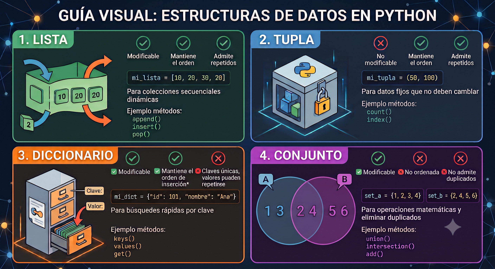

Los temas anteriores han presentado los tipos de datos básicos de Python —enteros, flotantes, cadenas y booleanos— que representan un único valor. En la práctica, la mayoría de los problemas interesantes requieren manipular **colecciones de valores**: las calificaciones de un grupo de alumnos, los coeficientes de un polinomio, los vértices de un polígono o los elementos de una muestra estadística.

Para representar algunas de estas colecciones, Python proporciona cuatro estructuras de datos nativas: **listas**, **tuplas**, **diccionarios** y **conjuntos**. Cada una tiene propiedades distintas que la hacen adecuada para situaciones diferentes.

{#fig-edas width=90%}

::: {#tip-eda .callout-tip title="Estructuras de datos"}
Una **estructura de datos** es una forma organizada de almacenar y relacionar datos en memoria, diseñada para hacer eficientes ciertas operaciones. No se trata solo de "guardar" datos, sino de elegir *cómo* guardarlos según qué operaciones necesitas hacer con ellos.

La elección importa porque el rendimiento de las operaciones a realizar depende de la estructura. Buscar un elemento en una lista requiere recorrerla entera en el peor de los casos; en un diccionario o conjunto, la búsqueda es muy eficiente.

La diferencia con lenguajes como C o Java es que en Python no necesitas implementar estas estructuras desde cero ni importar librerías externas: están disponibles con sintaxis directa (`[]`, `{}`, `()`). Esto permite centrarse en **cuál elegir en función del problema, no en cómo construirla**.
:::

---

## 4.1. Listas: secuencias ordenadas y mutables

Las listas son, sin lugar a dudas, la estructura de datos más utilizada y fundamental en Python. Si las variables normales son como "cajas" que guardan un solo dato (un número o un texto), las listas son como **archiveros u organizadores** donde puedes agrupar colecciones enteras de información bajo un mismo nombre.

::: {#tip-lista .callout-tip title="Lista"}
Una **lista** en Python es una secuencia **ordenada** y **mutable** de elementos. Puede contener cualquier combinación de tipos y su longitud puede cambiar durante la ejecución.

Matemáticamente, una lista de $n$ elementos corresponde a una sucesión finita $(a_0, a_1, \ldots, a_{n-1})$ indexada a partir de $0$. La mutabilidad —la posibilidad de modificar elementos, añadir o eliminar— es lo que distingue fundamentalmente a las listas de las cadenas y las tuplas (se verán adelante).
:::

::: {#imp-mutable .callout-important title="Objetos mutables e inmutables en Python"}
En Python, **mutable** significa que el contenido del objeto puede ser modificado *después* de haber sido creado, sin que este cambie su identidad (su ubicación en la memoria). Imagina que es como una caja abierta: puedes meter o sacar cosas de ella, pero la caja sigue siendo exactamente la misma.

Los objetos **inmutables** (como los cadenas `str`, los números `int` o `float`) son como cajas selladas. Si necesitas cambiar algo, Python no modifica el objeto original; en su lugar, destruye esa caja y crea una completamente nueva en la memoria con el nuevo valor.
:::

La enorme importancia de las listas en la programación con Python se resume en cuatro puntos clave:

- **Son el cuchillo suizo del lenguaje (Versatilidad):** A diferencia de otros lenguajes más estrictos, una lista en Python es increíblemente flexible. Puedes guardar números, textos, booleanos e incluso otras listas en su interior, ¡todo al mismo tiempo!
- **Son dinámicas y mutables:** Como vimos en la pregunta anterior, las listas pueden crecer o encogerse. Puedes agregar miles de datos nuevos, eliminar los que ya no sirvan o modificarlos sobre la marcha mientras tu programa se ejecuta.
- **Mantienen el orden:** Cada elemento que guardas en una lista tiene una posición numérica exacta (un índice, empezando a contar desde el cero). Esto es crucial cuando necesitas procesar datos en un orden específico o buscar algo en una posición concreta.
- **Son la puerta de entrada a datos complejos:** Entender cómo iterar (recorrer) y manipular listas es el paso previo y obligatorio antes de saltar a herramientas más avanzadas de la industria, como los *arrays* matemáticos de NumPy o las bases de datos en Pandas.

### **4.1.1 Creación e indexación**

Una lista se crea encerrando sus elementos entre corchetes `[]`, separados por comas. La función `list()` convierte cualquier iterable en lista:

```{pyodide}
notas = [8.5, 7.0, 9.5, 6.0, 8.0]
primos = [2, 3, 5, 7, 11, 13]
vacia = []
print(notas)
print(len(notas))      # 5
print(type(notas))     # <class 'list'>

print(list(range(1, 8)))    # [1, 2, 3, 4, 5, 6, 7]
print(list("Python"))       # ['P', 'y', 't', 'h', 'o', 'n']
```

Cada elemento tiene un **índice** entero que indica su posición y permite acceder a él. Python admite índices positivos (desde el inicio) y negativos (desde el final):

::: {#imp-indexacion .callout-important title="Indexación positiva y negativa"}
Dada una lista `a` con `n` elementos, el índice positivo `i` (con $0 \leq i < n$) accede al elemento `a[i]`, y el índice negativo `-k` (con $1 \leq k \leq n$) accede al elemento `a[n-k]`:

| Posición | 1.ª | 2.ª | … | penúltima | última |
|:---:|:---:|:---:|:---:|:---:|:---:|
| Índice positivo | `a[0]` | `a[1]` | … | `a[n-2]` | `a[n-1]` |
| Índice negativo | `a[-n]` | `a[-n+1]` | … | `a[-2]` | `a[-1]` |

```{pyodide}
notas = [8.5, 7.0, 9.5, 6.0, 8.0]
print(notas[0])    # 8.5   (primera)
print(notas[2])    # 9.5   (tercera)
print(notas[-1])   # 8.0   (última)
print(notas[-2])   # 6.0   (penúltima)
```
:::

::: {#cau-indexerror .callout-caution title="`IndexError`: índice fuera de rango"}
Acceder a un índice que no existe lanza un `IndexError`:

```python
notas = [8.5, 7.0, 9.5]
print(notas[5])    # IndexError: list index out of range
```

Usa `a[-1]` para el último elemento sin necesidad de conocer `len(a)`. Para iterar sobre todos los elementos, usa un bucle `for` directamente sobre la lista en lugar de iterar sobre índices: `for nota in notas:`.
:::

### **4.1.2 Sublistas (*slicing*)**

El operador de *slicing* extrae una **sublista** sin modificar la original. La sintaxis `lista[inicio:fin:paso]` funciona igual que en rangos (`range()`): `inicio` incluido, `fin` excluido, `paso` opcional:

```{pyodide}
p = [2, 3, 5, 7, 11, 13, 17, 19]
print(p[2:5])      # [5, 7, 11]       — índices 2, 3, 4
print(p[:4])       # [2, 3, 5, 7]     — los cuatro primeros
print(p[4:])       # [11, 13, 17, 19] — desde el índice 4 hasta el final
print(p[::2])      # [2, 5, 11, 17]   — uno de cada dos
print(p[::-1])     # [19, 17, ..., 2] — invertida
print(p[-3:])      # [13, 17, 19]     — los tres últimos
```

El resultado es siempre una **nueva lista** (copia superficial): modificar la sublista no altera la original.

::: {#imp-shalow .callout-important title="Copia superficial vs. copia profunda"}
Una **copia superficial** (shallow copy en inglés) de una lista es una nueva lista que contiene *referencias* a los mismos objetos que la original. Si alguno de los elementos en la copia son mutables, modificarlos en la copia afectará a la original.

Una **copia profunda** (deep copy en inglés) crea una nueva lista y también copia los objetos mutables contenidos en ella, de modo que la copia y la original son completamente independientes. 
:::

### **4.1.3 Mutabilidad: modificar listas**

Las listas son **mutables**: sus elementos pueden cambiarse directamente mediante asignación, y su tamaño puede modificarse:

```{pyodide}
v = [1, 2, 3, 4, 5]
v[0] = 10           # modifica el primer elemento
print(v)            # [10, 2, 3, 4, 5]

v[1:3] = [20, 30]   # reemplaza los elementos 1 y 2
print(v)            # [10, 20, 30, 4, 5]

v[1:3] = []         # elimina los elementos 1 y 2
print(v)            # [10, 4, 5]
```

### **4.1.4 Métodos y operaciones principales**

Las listas (objetos del tipo `list`) disponen de un conjunto de métodos que cubren las operaciones más comunes: añadir y eliminar elementos, buscar, ordenar e invertir.

Una distinción importante es si el método **modifica la lista en su lugar** o **devuelve un valor nuevo** sin tocarla. Confundir ambos casos es un error frecuente: `a.sort()` ordena `a` y devuelve `None`, mientras que `sorted(a)` deja `a` intacta y devuelve una lista nueva ordenada.

Además de los métodos propios, las listas admiten operaciones con operadores (`+`, `*`, `in`) y funciones built-in del lenguaje (`len()`, `sum()`, `min()`, `max()`, `sorted()`, `reversed()`), que funcionan sobre cualquier secuencia, no solo listas.

::: {#imp-metodos-lista .callout-important title="Métodos de las listas"}

| Método | Descripción | Modifica la lista |
|---|---|:---:|
| `a.append(x)` | Añade `x` al final | Sí |
| `a.extend(iterable)` | Añade todos los elementos del iterable al final | Sí |
| `a.insert(i, x)` | Inserta `x` en la posición `i` | Sí |
| `a.remove(x)` | Elimina la primera aparición de `x` (`ValueError` si no existe) | Sí |
| `a.pop(i=-1)` | Elimina y devuelve el elemento en posición `i` (por defecto el último) | Sí |
| `a.sort()` | Ordena en su lugar (modifica `a`) | Sí |
| `a.reverse()` | Invierte en su lugar | Sí |
| `a.index(x)` | Devuelve el índice de la primera aparición de `x` | No |
| `a.count(x)` | Cuenta las apariciones de `x` | No |
| `a.copy()` | Devuelve una copia superficial | No |
| `a.clear()` | Elimina todos los elementos | Sí |

```{pyodide}
a = [3, 1, 4, 1, 5, 9, 2, 6]
a.append(5)
print(a.count(1))   # 2
a.sort()
print(a)            # [1, 1, 2, 3, 4, 5, 5, 6, 9]
print(a.pop())      # 9 (elimina y devuelve el último)
print(a)            # [1, 1, 2, 3, 4, 5, 5, 6]
a.reverse()
print(a)            # [6, 5, 5, 4, 3, 2, 1, 1]
print(a.count(5))   # 2
```
:::

La función built-in `sorted(a)` devuelve una **nueva lista** ordenada sin modificar `a`. La función built-in `reversed(a)` devuelve un iterador inverso.

```{pyodide}
a = [3, 1, 4, 1, 5, 9, 2, 6]

# sorted() — devuelve una nueva lista ordenada, a queda intacta
b = sorted(a)
print(b)  # [1, 1, 2, 3, 4, 5, 6, 9]
c = sorted(a, reverse=True)
print(c)  # [9, 6, 5, 4, 3, 2, 1, 1]
print(a)  # [3, 1, 4, 1, 5, 9, 2, 6]  — sin cambios

# reversed() — devuelve un iterador inverso, a queda intacta
for x in reversed(a):
    print(x, end=" ")  # 6 2 9 5 1 4 1 3

# Convertir a lista si necesitas el resultado como lista
d = list(reversed(a))
print(d)  # [6, 2, 9, 5, 1, 4, 1, 3]
print(a)  # [3, 1, 4, 1, 5, 9, 2, 6]  — sin cambios
```

El operador `+` concatena dos listas (produciendo una nueva), `*` repite, e `in` comprueba pertenencia (coste $O(n)$):

```{pyodide}
print([1, 2] + [3, 4])     # [1, 2, 3, 4]
print([0] * 5)             # [0, 0, 0, 0, 0]
print(3 in [1, 2, 3, 4])   # True
```

::: {#nte-copy .callout-note title="Mutable vs inmutable con list.copy()"}
Para visualizar cómo se comportan los diferentes tipos de datos bajo una copia superficial usando `.copy()`, vamos a crear una lista que contenga tanto un elemento inmutable (un entero) como un elemento mutable (una lista).

```{pyodide}
# El 100 es inmutable. La lista [1, 2] es mutable.
lista_original = [100, [1, 2]]

# Hacemos una copia superficial
mi_copia = lista_original.copy()

# Como el 100 no se puede alterar (inmutable), Python simplemente
# reemplaza la conexión en la copia con un número nuevo (999).
mi_copia[0] = 999

# 2. Acción sobre el MUTABLE:
# Como las listas sí se pueden modificar (mutables), agregamos un número 
# a la lista [1, 2].
mi_copia[1].append(3)

print("Original:", lista_original)  # Original: [100, [1, 2, 3]]
print("Copia:   ", mi_copia)        # Copia:    [999, [1, 2, 3]]
```

Se observa que el elemento inmutable (el entero 100) no se ve afectado en la lista original por la modificación en la copia. El elemento mutable (la lista [1, 2]) sí se ve alterado, reflejando el comportamiento de las copias superficiales.
:::

### **4.1.5 Listas y matemáticas**

Las listas son la representación natural de los objetos matemáticos más básicos: un vector de $\mathbb{R}^n$ es una sucesión finita de números reales, los coeficientes de un polinomio forman una secuencia ordenada, y una matriz no es más que una sucesión de filas. La correspondencia entre el concepto matemático y la lista de Python es directa e inmediata.

En esta sección se ilustra esa correspondencia con ejemplos concretos: cómo representar vectores y calcular sus operaciones elementales, cómo evaluar un polinomio de forma eficiente usando el [algoritmo de Horner](https://es.wikipedia.org/wiki/Algoritmo_de_Horner), y cómo una lista de listas reproduce la estructura de una matriz. El objetivo no es reemplazar las herramientas del ecosistema científico —NumPy lo hará mucho mejor en el Tema 8— sino entender qué hay debajo: antes de usar `np.dot()` conviene saber implementar un producto escalar a mano.

::: {#nte-vector .callout-note title="Vectores y operaciones básicas"}
Una lista de flotantes representa naturalmente un vector de $\mathbb{R}^n$. La suma de vectores y el producto escalar se implementan con comprensiones (sección 4.5) o con la función `sum()`:

```{pyodide}
import math

u = [1.0, 2.0, 3.0]
v = [4.0, 5.0, 6.0]

# Suma de vectores
suma = [u[i] + v[i] for i in range(len(u))]
print(suma)                                  # [5.0, 7.0, 9.0]

# Producto escalar u·v = Σ uᵢvᵢ
prod_escalar = sum(u[i] * v[i] for i in range(len(u)))
print(prod_escalar)                          # 32.0

# Norma euclidiana ‖u‖ = √(Σ uᵢ²)
norma = math.sqrt(sum(x**2 for x in u))
print(f"‖u‖ = {norma:.6f}")                 # ‖u‖ = 3.741657
```
:::

::: {#nte-horner .callout-note title="Evaluación de un polinomio — algoritmo de Horner"}
Los coeficientes de un polinomio $p(x) = a_0 + a_1 x + \cdots + a_n x^n$ se almacenan en una lista `[a0, a1, ..., an]` (del grado menor al mayor). El **algoritmo de Horner** evalúa el polinomio en $O(n)$ operaciones sin calcular potencias:
$$
\begin{aligned}
p(x) &= a_0 + a_1 x + a_2 x^2 + \cdots + a_n x^n \\
     &= a_0 + x\bigl(a_1 + x\bigl(a_2 + x(\cdots + x \cdot a_n)\bigr)\bigr)
\end{aligned}
$$

Vamos a asumir que los coeficientes se almacenan en una lista `coefs` de forma que `coefs[i]` es el coeficiente de $x^i$.

```{pyodide}
def evaluar_horner(coefs: list[float], x: float) -> float:
    """
    Evalúa el polinomio p(x) = coefs[0] + coefs[1]*x + ... + coefs[n]*x^n
    usando el algoritmo de Horner.

    Precondición: coefs no está vacía.
    Devuelve: el valor numérico de p(x).
    """
    resultado = 0.0
    for c in reversed(coefs):
        resultado = resultado * x + c
    return resultado


# p(x) = 1 + 2x + 3x²
coefs = [1, 2, 3]
print(evaluar_horner(coefs, 0))    # 1
print(evaluar_horner(coefs, 1))    # 6    (1 + 2 + 3)
print(evaluar_horner(coefs, 2))    # 17   (1 + 4 + 12)
print(evaluar_horner(coefs, -1))   # 2    (1 - 2 + 3)
```
:::

::: {#nte-lista-anidada .callout-note title="Listas de listas: matrices y acceso por doble índice"}
Una lista puede contener otras listas como elementos. El acceso usa dos índices consecutivos: `matriz[fila][columna]`.

```{pyodide}
# Matriz 3×3 como lista de listas
matriz = [
    [1, 2, 3],
    [4, 5, 6],
    [7, 8, 9]
]

print(matriz[0])        # [1, 2, 3]  — primera fila completa
print(matriz[0][1])     # 2          — fila 0, columna 1
print(matriz[2][2])     # 9          — fila 2, columna 2
print(matriz[-1][0])    # 7          — última fila, primer elemento

# Recorrer toda la matriz
for fila in matriz:
    for elemento in fila:
        print(elemento, end=" ")
    print()
```

La lectura es de izquierda a derecha: `matriz[i]` devuelve la lista de la "fila" `i`, y sobre ese resultado se aplica `[j]` para obtener el elemento de la "columna" `j`. Esta representación corresponde directamente a una matriz $n \times n$ donde $a_{ij}$ se accede como `matriz[i][j]`.
:::

---

## 4.2. Tuplas: secuencias ordenadas e inmutables

Las tuplas son, en apariencia, listas que no se pueden modificar. Pero esa definición por negación no hace justicia a su papel: la inmutabilidad no es una restricción arbitraria, sino una **garantía de diseño** que comunica una intención. Cuando una función devuelve una tupla `(cociente, resto)` o cuando se almacenan las coordenadas de un punto como `(x, y)`, el programador está diciendo explícitamente que esos valores forman una unidad fija que no debe cambiar.

Esta distinción semántica tiene consecuencias prácticas directas. Al ser inmutables, las tuplas pueden usarse como claves de diccionario o como elementos de un conjunto, algo imposible con listas. Son también ligeramente más eficientes en memoria y acceso, aunque esa diferencia rara vez es determinante en la práctica.

La regla informal para elegir entre lista y tupla es: 

- usa una lista cuando la colección puede crecer, encogerse o cambiar; 
- usa una tupla cuando los elementos forman una estructura fija con un significado conjunto:
    - las coordenadas de un punto, 
    - los componentes de un vector de dimensión conocida, 
    - los valores de retorno múltiple de una función.

::: {#tip-tupla .callout-tip title="Tupla"}
Una **tupla** en Python es una secuencia **ordenada** e **inmutable** de elementos. Una vez creada, no puede modificarse: no se pueden añadir, eliminar ni cambiar sus elementos.

La inmutabilidad hace que las tuplas puedan usarse como claves de diccionarios y como elementos de conjuntos, algo que las listas no permiten. Se usan cuando se quiere garantizar que una colección de valores permanece constante (coordenadas de un punto, colores RGB, un par $(q, r)$ de cociente y resto…).
:::

### **4.2.1 Creación e inmutabilidad**

Las tuplas se crean con paréntesis `()` o simplemente separando los elementos por comas. Para una tupla de un solo elemento, la coma final es **obligatoria**:

```{pyodide}
punto   = (3.0, 4.0)         # par ordenado
rgb     = (255, 128, 0)       # color RGB
sin_par = 1, 2, 3             # también es tupla: (1, 2, 3)
vacia   = ()
print(punto, type(punto))
print(sin_par, type(sin_par))
```

::: {#imp-tupla-uno .callout-important title="Tupla de un elemento: la coma es obligatoria"}
Paréntesis sin coma **no crean una tupla**; simplemente agrupan una expresión. Los paréntesis son opcionales para definir tuplas, pero la coma final es obligatoria para una tupla de un solo elemento:

```{pyodide}
no_es_tupla = (42)     # <class 'int'>
si_es_tupla = (42,)    # <class 'tuple'>
otra_tupla = 42,       # <class 'tuple'>
print(type(no_es_tupla))
print(type(si_es_tupla))
print(type(otra_tupla))
```
:::

La indexación y el *slicing* funcionan igual que en las listas, pero cualquier intento de modificar una tupla lanza `TypeError`:

```python
punto = (3.0, 4.0)
print(punto[0])        # 3.0
punto[0] = 5.0         # TypeError: 'tuple' object does not support item assignment
```

### **4.2.2 Desempaquetado**

El **desempaquetado** (*unpacking*) asigna los elementos de una tupla (o de cualquier iterable) a varias variables en una sola instrucción:

```{pyodide}
punto = (3.0, 4.0)
x, y = punto
print(f"x = {x}, y = {y}")    # x = 3.0, y = 4.0

# Intercambio (swap) sin variable auxiliar
a, b = 10, 20
a, b = b, a
print(a, b)    # 20 10
```

### **4.2.3 Retorno múltiple**

El **retorno múltiple** en Python es la capacidad que tiene una función para devolver más de un valor al mismo tiempo en una sola instrucción `return`. En lenguajes más antiguos o estrictos, una función solo puede devolver un único resultado. Si necesitabas devolver varios datos, tenías que crear un arreglo, un objeto o usar punteros. En Python, es tan natural como separar las variables por comas (tupla).

::: {#nte-retorno .callout-note title="Retorno múltiple con tuplas"}
Una función puede devolver varios valores empaquetándolos en una tupla. El llamador los desempaqueta directamente:

```{pyodide}
import math

def division_euclidea(a: int, b: int) -> tuple[int, int]:
    """
    Devuelve el cociente y el resto de la división entera de a entre b,
    es decir, el único par (q, r) tal que a = b·q + r con 0 ≤ r < |b|.

    Precondición: b != 0.
    """
    return a // b, a % b

cociente, resto = division_euclidea(17, 5)
print(f"17 = 5 × {cociente} + {resto}")    # 17 = 5 × 3 + 2

def polar(x: float, y: float) -> tuple[float, float]:
    """
    Convierte el punto (x, y) en coordenadas cartesianas a polares (r, θ),
    donde r = √(x² + y²) es el módulo y θ = atan2(y, x) ∈ (-π, π] es el argumento.

    Precondición: (x, y) != (0, 0) si se requiere θ bien definido.
    """
    return math.sqrt(x**2 + y**2), math.atan2(y, x)

r, theta = polar(3.0, 4.0)
print(f"r = {r:.4f},  θ = {theta:.4f} rad")    # r = 5.0000,  θ = 0.9273 rad
```
:::

### **4.2.4 Métodos y operaciones principales**

A diferencia de las listas, las tuplas disponen de tan solo dos métodos: `count()` e `index()`. Esta ausencia no es un olvido del lenguaje sino una consecuencia directa de la inmutabilidad: no tiene sentido ofrecer métodos para añadir, eliminar u ordenar elementos que no pueden cambiar.

Lo que sí comparten con las listas es la capacidad de ser **iteradas** con un bucle `for`, de ser consultadas con `in`, y de ser medidas con `len()`. En la práctica, una tupla se recorre exactamente igual que una lista; la diferencia es que no se puede modificar nada durante el recorrido.

```{pyodide}
t = (4, 1, 2, 1, 3, 1)

# Los dos métodos propios de las tuplas
print(t.count(1))     # 3   — cuántas veces aparece 1
print(t.index(2))     # 2   — índice de la primera aparición de 2

# Funciones built-in que funcionan con cualquier secuencia
print(len(t))         # 6
print(min(t))         # 1
print(max(t))         # 4
print(sum(t))         # 12

# Operadores
print(3 in t)         # True
print((1, 2) + (3,))  # (1, 2, 3)  — concatenación, produce tupla nueva
print((1, 2) * 3)     # (1, 2, 1, 2, 1, 2)

# Iteración
for x in t:
    print(x, end=" ")    # 4 1 2 1 3 1
```

### **4.2.5 Tuplas y matemáticas**

Las tuplas son la representación natural de los objetos matemáticos que no pueden modificarse. Por ejemplo, un punto de $\mathbb{R}^2$ es un par ordenado de coordenadas, una fracción irreducible es un par de enteros. 

Combinando tuplas y listas, se pueden representar estructuras más complejas como polígonos. Los vertices del polígono se pueden almacenar como una lista de tuplas.

::: {#nte-poligono .callout-note title="Polígonos: lista de vértices como tuplas"}
Un polígono de $n$ vértices se representa como una **lista de tuplas**: la lista refleja que el número de vértices puede variar (o construirse incrementalmente), y cada tupla refleja que las coordenadas de un vértice son fijas e inmutables.

```{pyodide}
import math


def perimetro(vertices: list[tuple[float, float]]) -> float:
    """
    Calcula el perímetro de un polígono dado como lista de vértices (x, y).

    Precondición: len(vertices) >= 2.
    """
    n = len(vertices)
    total = 0.0
    for i in range(n):
        x1, y1 = vertices[i]
        x2, y2 = vertices[(i + 1) % n]    # el último vértice conecta con el primero
        total += math.sqrt((x2 - x1)**2 + (y2 - y1)**2)
    return total


def area(vertices: list[tuple[float, float]]) -> float:
    """
    Calcula el área de un polígono simple (fórmula de Gauss/del lazador).

    Precondición: len(vertices) >= 3.
    """
    n = len(vertices)
    s = 0.0
    for i in range(n):
        x1, y1 = vertices[i]
        x2, y2 = vertices[(i + 1) % n]
        s += x1 * y2 - x2 * y1
    return abs(s) / 2.0


# Cuadrado de lado 1
cuadrado = [(0.0, 0.0), (1.0, 0.0), (1.0, 1.0), (0.0, 1.0)]
print(f"Perímetro: {perimetro(cuadrado):.4f}")    # 4.0
print(f"Área:      {area(cuadrado):.4f}")          # 1.0

# Triángulo equilátero de lado 1
h = math.sqrt(3) / 2
triangulo = [(0.0, 0.0), (1.0, 0.0), (0.5, h)]
print(f"Perímetro: {perimetro(triangulo):.4f}")    # 3.0
print(f"Área:      {area(triangulo):.4f}")          # 0.4330...
```
:::

La fórmula del área es la del **lazador** (*shoelace formula*):
$$
A = \frac{1}{2}\left|\sum_{i=0}^{n-1}(x_i\, y_{i+1} - x_{i+1}\, y_i)\right|
$$
donde los índices son módulo $n$ (el vértice $n$ es el vértice $0$). Es una fórmula elegante que aparece en geometría computacional y que se implementa directamente con el bucle anterior.

---

## 4.3. Diccionarios: mapeos clave-valor

::: {#tip-diccionario .callout-tip title="Diccionario"}
Un **diccionario** en Python es una colección **mutable** de pares **clave–valor** donde las claves son únicas. Desde Python 3.7, el orden de inserción se preserva.

Matemáticamente, un diccionario implementa una **función finita** $f: K \to V$ donde $K$ es el conjunto de claves y $V$ el de valores. Las claves deben ser **hashables** (inmutables: enteros, flotantes, cadenas, tuplas…).

La búsqueda, inserción y eliminación tienen coste **promedio $O(1)$** gracias a la tabla hash interna, lo que los hace extraordinariamente eficientes frente a las listas ($O(n)$ para búsqueda).
:::

### **4.3.1 Creación y acceso**

Los diccionarios se crean con llaves `{}` usando la sintaxis `clave: valor`, o con `dict()`:

```{pyodide}
alumno = {
    "nombre": "Ana",
    "nota":   9.5,
    "aprobado": True,
}
print(alumno)
print(len(alumno))    # 3
```

El acceso a un valor se realiza por clave. El método `.get()` es más seguro porque devuelve `None` (o un valor por defecto) si la clave no existe, sin lanzar error:

```{pyodide}
alumno = {"nombre": "Ana", "nota": 9.5}

print(alumno["nombre"])             # "Ana"
print(alumno.get("nota"))           # 9.5
print(alumno.get("edad"))           # None  — sin error
print(alumno.get("edad", 18))       # 18    — valor por defecto
```

::: {#cau-keyerror .callout-caution title="`KeyError`: clave inexistente"}
Acceder con `[]` a una clave que no existe lanza `KeyError`:

```python
d = {"a": 1}
print(d["b"])    # KeyError: 'b'
```

La alternativa segura es `d.get(clave)` o comprobar antes con `clave in d`.
:::

La asignación añade o actualiza pares, y `del` elimina uno:

```{pyodide}
d = {"a": 1, "b": 2}
d["c"] = 3        # añade
d["a"] = 10       # modifica
del d["b"]        # elimina
print(d)          # {'a': 10, 'c': 3}
```

Dado que las tuplas son **hashables**, pueden usarse como claves de diccionario: esto permite indexar tablas por pares o triples de valores, algo imposible con listas. El siguiente ejemplo muestra cómo almacenar en un diccionario distancias al origen de coordenadas de un punto $ (x, y) \in \mathbb{R}^2 $. El diccionario tiene como claves tuplas `(x, y)` que representan las coordenadas del punto, el valor asociado es la distancia euclidiana al origen:

```{pyodide}
# Tabla de distancias al origen de coordenadas
distancias = {
    (0, 0): 0.0,
    (1, 0): 1.0,
    (0, 1): 1.0,
    (1, 1): math.sqrt(2),
}
print(f"dist(1,1) = {distancias[(1, 1)]:.6f}")    # 1.414213…
```

### **4.3.2 Métodos principales e iteración**

Los diccionarios exponen tres **vistas** que permiten acceder por separado a claves, valores o pares: `d.keys()`, `d.values()` y `d.items()`. Son objetos dinámicos —reflejan el estado actual del diccionario en todo momento— y son la base de la iteración idiomática en Python.

La forma más común de recorrer un diccionario es con `.items()`, que en cada iteración desempaqueta directamente el par `(clave, valor)` en dos variables. Iterar sobre el diccionario directamente (`for k in d`) equivale a iterar sobre sus claves, igual que `for k in d.keys()`.

Además de las vistas, los diccionarios ofrecen métodos para acceso seguro (`.get()`), inserción condicional (`.setdefault()`), fusión (`.update()`) y eliminación con retorno del valor (`.pop()`).

::: {#imp-metodos-dic .callout-important title="Métodos principales de los diccionarios"}

| Método | Descripción |
|---|---|
| `d.keys()` | Vista de todas las claves |
| `d.values()` | Vista de todos los valores |
| `d.items()` | Vista de pares `(clave, valor)` |
| `d.get(k, v)` | Devuelve `d[k]` o `v` si `k` no existe (por defecto `None`) |
| `d.update(otro)` | Añade o sobreescribe con los pares de `otro` |
| `d.pop(k)` | Elimina y devuelve `d[k]` |
| `d.setdefault(k, v)` | Si `k` no existe, lo inserta con valor `v` y lo devuelve |

La forma idiomática de iterar sobre un diccionario es con `.items()`, que devuelve pares `(clave, valor)`:

```{pyodide}
poblacion = {"Madrid": 3_300_000, "Barcelona": 1_620_000, "Valencia": 800_000}

for ciudad, hab in poblacion.items():
    print(f"{ciudad}: {hab:,} habitantes")
```
:::

El operador `in` comprueba la presencia de una **clave** en tiempo $O(1)$:

```{pyodide}
d = {"a": 1, "b": 2, "c": 3}
print("a" in d)     # True
print("z" in d)     # False
print(1 in d)       # False — comprueba claves, no valores
```

### **4.3.3 Diccionarios y matemáticas**

::: {#nte-tabla-factorial .callout-note title="Diccionario para función discreta finita"}
Un diccionario es la estructura natural para una **función discreta finita**: las claves son los elementos del dominio y los valores las imágenes. El acceso a cualquier valor es $O(1)$ independientemente del tamaño de la tabla.

```{pyodide}
# Tabla de factoriales {n: n!} para n = 0..10
def factorial(n: int) -> int:
    """
    Devuelve el factorial de n, definido como n! = n · (n-1) · … · 1, 
    con 0! = 1. Versión recursiva.

    Precondición: n >= 0.
    """
    return 1 if n == 0 else n * factorial(n - 1)


tabla = {n: factorial(n) for n in range(11)}
print(f"7!  = {tabla[7]}")     # 5040
print(f"10! = {tabla[10]}")    # 3628800
```
:::

::: {#nte-polinomio .callout-note title="Diccionario para polinomios dispersos"}
Un diccionario también permite representar **polinomios dispersos** (con muchos coeficientes nulos) de forma compacta: las claves son los grados y los valores los coeficientes no nulos.

```{pyodide}
def evaluar_disperso(p: dict[int, float], x: float) -> float:
    """
    Evalúa el polinomio disperso p en x.

    p representa un polinomio mediante un diccionario {grado: coeficiente},
    donde solo se almacenan los términos con coeficiente no nulo.
    Por ejemplo, 5x^100 - 3x^10 + 7 se representa como {100: 5, 10: -3, 0: 7}.

    Precondición: los grados (claves) son enteros no negativos.
    """
    resultado = 0.0
    for grado, coef in p.items():
        resultado += coef * x**grado
    return resultado


# p(x) = 5x^100 − 3x^10 + 7  →  solo almacena los términos no nulos
p = {100: 5, 10: -3, 0: 7}

print(evaluar_disperso(p, 1))    # 9.0
print(evaluar_disperso(p, 0))    # 7.0
print(evaluar_disperso(p, 2))    # 6.338253001141147e+30
```
:::

::: {#nte-matdis .callout-note title="Diccionario para matrices dispersas"}
Una **matriz dispersa** tiene la mayoría de sus entradas a cero. Almacenarla como lista de listas desperdiciaría memoria; un diccionario con claves `(fila, columna)` solo guarda las entradas no nulas:

```{pyodide}
def get(M: dict[tuple[int, int], float], i: int, j: int) -> float:
    """
    Devuelve el elemento M[i, j] de la matriz dispersa M.
    Si la entrada no está almacenada explícitamente, devuelve 0.0.

    Precondición: i y j son índices válidos para la dimensión de M.
    """
    return M.get((i, j), 0.0)


def producto_matriz_vector(
    M: dict[tuple[int, int], float],
    v: list[float],
    n: int
) -> list[float]:
    """
    Multiplica la matriz dispersa M (n×n) por el vector v de longitud n.
    Solo itera sobre las entradas no nulas de M, lo que resulta
    eficiente cuando la mayoría de los elementos son cero.

    Precondición: len(v) == n y todas las claves (i, j) de M satisfacen
    0 <= i < n y 0 <= j < n.
    Devuelve: lista de n floats con el resultado del producto M·v.
    """
    resultado = [0.0] * n
    for (i, j), valor in M.items():
        resultado[i] += valor * v[j]
    return resultado


# Matriz dispersa 5×5: solo 4 entradas no nulas
# ⎡1 0 0 0 0⎤
# ⎢0 0 2 0 0⎥
# ⎢0 0 0 0 0⎥
# ⎢0 0 0 5 0⎥
# ⎣0 0 0 0 3⎦

M = {
    (0, 0): 1.0,
    (1, 2): 2.0,
    (3, 3): 5.0,
    (4, 4): 3.0,
}

print(get(M, 1, 2))       # 2.0
print(get(M, 2, 2))       # 0.0  — cero implícito

v = [1.0, 1.0, 1.0, 1.0, 1.0]
print(producto_matriz_vector(M, v, 5))    # [1.0, 2.0, 0.0, 5.0, 3.0]
```

La clave `(i, j)` es una tupla —hashable e inmutable— lo que ilustra directamente por qué las tuplas pueden ser claves de diccionario y las listas no. En matrices con millones de entradas pero pocas no nulas (matrices de rigidez en elementos finitos, grafos de la web), este enfoque reduce dramáticamente el uso de memoria.
:::

::: {#tip-grafos .callout-tip title="Teoría de grafos"}
La **teoría de grafos** es una rama de las matemáticas y de las ciencias de la computación que estudia las **relaciones entre objetos** a través de una estructura matemática formal llamada **grafo**. Un grafo se define como un conjunto de objetos llamados **vértices** (o nodos) unidos por enlaces llamados **aristas** (o arcos), que permiten representar relaciones binarias entre elementos de un conjunto. 

Un **grafo** $G = (V, E)$ consiste entonces en un conjunto de **vértices** (**nodos**) $V$ y un conjunto de **aristas** (**arcos**) $E \subseteq \{\{u, v\} \mid u, v \in V\}$ que representan conexiones entre pares de vértices. Cuando las aristas tienen dirección se habla de **grafo dirigido** (**dígrafo**); cuando tienen un peso numérico asociado, de **grafo ponderado**.

Las dos representaciones clásicas de un grafo $G = (V, E)$ con $n = |V|$ vértices y $m = |E|$ aristas son:

- **Lista de adyacencia** — para cada vértice $u$ se almacena el conjunto de sus vecinos. Es eficiente cuando el grafo es **disperso** (pocas aristas respecto al máximo posible $n^2$).

- **Matriz de adyacencia** — una matriz $A$ de $n \times n$ donde $A[i][j] = 1$ si existe la arista $\{i, j\}$ y $0$ en caso contrario. Es ineficiente para grafos dispersos pero conveniente para grafos **densos** y para ciertos cálculos matriciales: por ejemplo, $A^k[i][j]$ cuenta el número de caminos de longitud exactamente $k$ entre $i$ y $j$.

En la práctica, la lista de adyacencia es la representación por defecto; la matriz de adyacencia se reserva para algoritmos que explotan explícitamente la estructura algebraica de los grafos.

**Conceptos Clave**

- **Adyacencia:** Dos vértices son adyacentes (vecinos) si existe una arista que los conecta directamente.
- **Grado (Degree):** Es el número de aristas que inciden en un vértice. En digrafos, se distingue entre grado de entrada (in-degree) y grado de salida (out-degree).
- **Camino (Path):** Una secuencia de vértices donde cada vértice adyacente está conectado por una arista, sin repetir vértices.
- **Ciclo:** Un camino que empieza y termina en el mismo vértice.
- **Grafo Conexo:** Un grafo donde existe al menos un camino entre cualquier par de vértices.
:::

::: {#nte-grafo .callout-note title="Diccionarios y grafos"}
La forma más "Pythonica" y eficiente de representar grafos es Python en la mayoría de los casos (especialmente si el grafo tiene muchos nodos pero pocas conexiones) es mediante diccionarios. Para grafos y digrados se emplea un diccionario donde las claves son los nodos y los valores son la lista de adyacencia en forma de conjunto (`set`). Para un grafo ponderado la lista de adyacencia se representa mediante un diccionario que contiene pares `{nodo: peso}`.

```python
# grafo no dirigido dict[int, set[int]]
g = {1: {2, 3}, 2: {1, 4},3: {1}, 4: {2}}

# digrafo dict[int, set[int]] pero sin simetría, arista 1→2 si pero 2→1 no  
d = {1: {2, 3}, 2: {4}, 3: {4}, 4: {3}}  

# grafo ponderado dict[int, dict[int, float]]   
w = {1: {2: 1.5, 3: 2.0}, 2: {1: 1.5, 4: 3.5}, 3: {1: 2.0}, 4: {2: 3.5}}
```

En todos los casos la comprobación de adyacencia es eficiente gracias al uso de `set` o `dict` para los vecinos, a diferencia de una lista de adyacencia donde habría que recorrerla entera.

```{pyodide}
def agregar_arista(g: dict[int, set[int]], u: int, v: int) -> None:
    """
    Añade la arista {u, v} al grafo no dirigido g.
    Crea los nodos u y v si no existen.
    """
    g.setdefault(u, set()).add(v)
    g.setdefault(v, set()).add(u)
	

def grado(g: dict[int, set[int]], u: int) -> int:
    """
    Devuelve el grado del nodo u, es decir, el número de aristas incidentes en él.
	
    Precondición: u pertenece a g.
    """
    return len(g[u])
	

def es_adyacente(g: dict[int, set[int]], u: int, v: int) -> bool:
    """
    Devuelve True si existe la arista {u, v} en el grafo g.
	
    Precondición: u y v pertenecen a g.
    """
    return v in g[u]


# Grafo de ejemplo:
#   1 — 2 — 4
#   |   |
#   3   5 — 6

grafo: dict[int, set[int]] = {
    1: {2, 3},
    2: {1, 4, 5},
    3: {1},
    4: {2},
    5: {2, 6},
    6: {5},
}

# Diccionario para los grados de cada nodo
grados = {}
for u in grafo:
    grados[u] = grado(grafo, u)
print(grados)
# {1: 2, 2: 3, 3: 1, 4: 1, 5: 2, 6: 1}

print(es_adyacente(grafo, 2, 5))    # True
print(es_adyacente(grafo, 1, 6))    # False
```
:::

---

## 4.4. Conjuntos: colecciones no ordenadas de elementos únicos

Los conjuntos (`set`) son la estructura de datos de Python que traslada directamente el concepto matemático de conjunto: una colección **no ordenada** de elementos **únicos**. A diferencia de las listas, no existe noción de posición ni se admiten duplicados; a diferencia de los diccionarios, solo se almacenan valores, no pares clave-valor. Su rasgo más característico es que soportan de forma nativa las operaciones clásicas del álgebra de conjuntos —unión, intersección, diferencia y diferencia simétrica— con una sintaxis concisa y eficiente. En la práctica, los conjuntos son la herramienta natural cuando lo que importa es **pertenencia** y **unicidad**, no orden ni multiplicidad: eliminar duplicados de una colección, comprobar si dos grupos comparten elementos, o calcular qué hay en uno pero no en el otro.

::: {#tip-conjunto .callout-tip title="Conjunto"}
Un **conjunto** (*tipo set*) en Python es una colección **no ordenada** de elementos **únicos** y **hashables**. Implementa directamente el concepto matemático de conjunto de la teoría de Cantor.

Sus propiedades fundamentales son:

- **Sin duplicados**: añadir un elemento ya presente no tiene efecto.
- **Sin orden**: no hay indexación por posición.
- **Pertenencia en $O(1)$**: `x in s` es operación de tiempo constante, frente al $O(n)$ de las listas.

Existe también `frozenset`, la versión **inmutable** de `set` (usable como clave de diccionario).
:::

### **4.4.1 Creación**

Los conjuntos se crean con llaves `{}` o con `set()`. **Atención**: `{}` vacío crea un diccionario, no un conjunto:

```{pyodide}
A = {1, 2, 3, 4, 5}
B = {3, 4, 5, 6, 7}
desde_lista = set([1, 2, 2, 3, 3, 3])    # elimina duplicados
vacio = set()                              # OBLIGATORIO para conjunto vacío
print(A)
print(desde_lista)    # {1, 2, 3}
print(type(vacio))    # <class 'set'>
```

::: {#cau-conjunto-vacio .callout-caution title="`{}` crea un diccionario vacío, no un conjunto"}
```{pyodide}
mal  = {}        # <class 'dict'>
bien = set()     # <class 'set'>
print(type(mal))
print(type(bien))
```
:::

### **4.4.2 Operaciones del álgebra de conjuntos**

Las operaciones del álgebra de conjuntos son precisamente el punto donde `set` deja de ser una mera colección y se convierte en una herramienta matemática. Python implementa las cuatro operaciones clásicas —unión, intersección, diferencia y diferencia simétrica— tanto mediante **operadores simbólicos** (`|`, `&`, `-`, `^`) como mediante **métodos** (`.union()`, `.intersection()`, `.difference()`, `.symmetric_difference()`). La distinción entre ambas formas es sutil pero relevante: los operadores exigen que ambos operandos sean conjuntos, mientras que los métodos aceptan cualquier iterable como argumento. Todas estas operaciones devuelven un **nuevo conjunto** sin modificar los originales.

::: {#imp-ops-conjunto .callout-important title="Operaciones de conjuntos en Python"}
Python implementa las operaciones clásicas de la teoría de conjuntos con operadores simbólicos:

| Operación matemática | Operador Python | Método equivalente |
|---|:---:|---|
| Unión $A \cup B$ | `A \| B` | `A.union(B)` |
| Intersección $A \cap B$ | `A & B` | `A.intersection(B)` |
| Diferencia $A \setminus B$ | `A - B` | `A.difference(B)` |
| Diferencia simétrica $A \triangle B$ | `A ^ B` | `A.symmetric_difference(B)` |
| Subconjunto $A \subseteq B$ | `A <= B` | `A.issubset(B)` |
| Subconjunto propio $A \subsetneq B$ | `A < B` | — |
| Superconjunto $A \supseteq B$ | `A >= B` | `A.issuperset(B)` |
| Disjuntos $A \cap B = \emptyset$ | — | `A.isdisjoint(B)` |

```{pyodide}
A = {1, 2, 3, 4, 5}
B = {3, 4, 5, 6, 7}

print(f"A ∪ B = {A | B}")     # {1, 2, 3, 4, 5, 6, 7}
print(f"A ∩ B = {A & B}")     # {3, 4, 5}
print(f"A \\ B = {A - B}")     # {1, 2}
print(f"A △ B = {A ^ B}")     # {1, 2, 6, 7}
print(f"A ⊆ A: {A <= A}")     # True
print(f"A ⊂ A: {A < A}")      # False (no es subconjunto propio)
```
:::

Los métodos `add()`, `remove()` y `discard()` modifican el conjunto. La diferencia entre los dos últimos es que `discard()` no lanza error si el elemento no existe:

```{pyodide}
s = {1, 2, 3}
s.add(4)          # añade 4
s.add(2)          # sin efecto (ya existe)
s.discard(10)     # sin error aunque 10 no esté
# s.remove(10)    # KeyError si no existe
print(s)          # {1, 2, 3, 4}
```

Una propiedad fundamental es la **eficiencia del test de pertenencia**. Para comprobar si un elemento está en una colección de $n$ elementos, una lista requiere $O(n)$ comparaciones en el peor caso, mientras que un conjunto lo hace en $O(1)$ amortizado:

```{pyodide}
import time

n = 1_000_000
lista  = list(range(n))
conj   = set(range(n))
valor  = n - 1  # último elemento, peor caso para la lista

t0 = time.perf_counter()
_ = valor in lista
t_lista = time.perf_counter() - t0
print(f"Lista:    {t_lista:.6f} s")

t0 = time.perf_counter()
_ = valor in conj
t_conj = time.perf_counter() - t0
print(f"Conjunto: {t_conj:.6f} s")

print(f"El conjunto es {t_lista / t_conj:.0f}× más rápido")
```

### **4.4.3 Conjuntos y matemáticas**

Anteriormente se ha visto que los conjuntos son la estructura natural para traducir directamente a Python el concepto matemático de conjunto. Esto permite implementar de forma inmediata algoritmos clásicos de teoría de números, como el cálculo del máximo común divisor (MCD) y del mínimo común múltiplo (MCM) mediante la intersección y la unión de conjuntos de divisores.

::: {#nte-divisores .callout-note title="Divisores y MCD con conjuntos"}
El conjunto de divisores de un entero es un objeto matemático natural que se representa directamente con un `set`. Las operaciones de conjuntos dan el MCD y el MCM de forma inmediata:

```{pyodide}
def divisores(n: int) -> set[int]:
    """
    Devuelve el conjunto de divisores positivos de n.

    Precondición: n >= 1.
    """
    resultado = set()
    for d in range(1, int(n**0.5) + 1):
        if n % d == 0:
            resultado.add(d)
            resultado.add(n // d)
    return resultado


D18 = divisores(18)
D24 = divisores(24)
print(f"Div(18) = {D18}")
print(f"Div(24) = {D24}")

divisores_comunes = D18 & D24
print(f"Divisores comunes: {divisores_comunes}")

print(f"MCD(18, 24) = {max(divisores_comunes)}")     # 6
print(f"MCM(18, 24) = {min(D18 | D24)}")             # 72
```

En la función `divisores()`, el bucle solo itera hasta $\sqrt{n}$, añadiendo a la vez el divisor y su complemento. Esto reduce el número de iteraciones a $O(\sqrt{n})$ frente a $O(n)$ de un enfoque ingenuo. Esto se basa en que los divisores de un número aparecen en pares: si $d$ divide a $n$, entonces también lo hace $n/d$ (Si $d \mid n$, existe un entero $k$ tal que $n = d \cdot k$. Entonces $k = n/d$, y como $n = k \cdot d$, se tiene que $k \mid n$).
:::

Otro ejemplo clásico es la **criba de Eratóstenes** para generar todos los números primos hasta un límite $n$. Lo veremos en el @nte-criba en la próxima sección, donde se implementa con conjuntos y operaciones de conjuntos.

---

## 4.5. Comprensión de listas, diccionarios y conjuntos

Una de las características más expresivas de Python es la **comprensión** (*comprehension* en inglés): una sintaxis compacta para construir listas, diccionarios y conjuntos a partir de cualquier iterable, con un filtro opcional. Su importancia va más allá de la brevedad: una comprensión bien escrita comunica la *intención* directamente, sin el ruido de variables auxiliares ni llamadas a `.append()`.

La correspondencia con la notación matemática de conjuntos es inmediata. La expresión $\{x^2 \mid x \in \mathbb{Z},\ 1 \leq x \leq 5\}$ se escribe en Python como `{x**2 for x in range(1, 6)}`. Es la traducción directa a Python de la notación de comprensión de conjuntos de la teoría de conjuntos:
$$
\bigl\{\ f(x)\ \bigm|\ x \in A,\; P(x)\ \bigr\}
\quad\longleftrightarrow\quad
\texttt{[f(x)\ for\ x\ in\ A\ if\ P(x)]}
$$
Esta alineación entre matemática y código es especialmente valiosa: permite expresar transformaciones y filtros sobre colecciones de datos de forma que el código refleje fielmente el enunciado del problema.

Las comprensiones no son un atajo estilístico opcional: aparecen de forma ubicua en código Python real, en bibliotecas científicas y en ejemplos de la documentación oficial. Dominarlas es, en la práctica, una condición necesaria para leer y escribir Python con fluidez.

::: {#tip-comprension .callout-tip title="Comprensión de listas"}
Una **comprensión de listas** construye una nueva lista evaluando una expresión para cada elemento de un iterable, con un filtro opcional:

```python
[expresión  for variable in iterable]                # sin filtro
[expresión  for variable in iterable  if condición]  # con filtro
```

Es **equivalente** a un bucle `for` con `append`, pero más concisa y generalmente más eficiente:

```python
resultado = []
for variable in iterable:
    if condición:
        resultado.append(expresión)
```

La comprensión es una **expresión** (produce un valor), mientras que el bucle equivalente es una **secuencia de instrucciones**. Esto permite usarla directamente en argumentos de funciones, asignaciones y otras expresiones [@pep202].
:::

### **4.5.1 Comprensión de listas**

```{pyodide}
# Cuadrados del 1 al 10
cuadrados = [x**2 for x in range(1, 11)]
print(cuadrados)

# Cuadrados de los impares del 1 al 20
cuad_impares = [x**2 for x in range(1, 21) if x % 2 != 0]
print(cuad_impares)

# Transformar cadenas
palabras = ["hola", "mundo", "python"]
print([p.capitalize() for p in palabras])    # ['Hola', 'Mundo', 'Python']
```

Las comprensiones admiten **anidamiento** para generar matrices u otras estructuras bidimensionales:

```{pyodide}
# Matriz n×n inicializada a ceros
n = 4
matriz = [[0] * n for _ in range(n)]
print(matriz)

# Tabla de multiplicar como lista de listas
tabla = [[i * j for j in range(1, 7)] for i in range(1, 7)]
for fila in tabla:
    print(fila)
```

::: {.callout-caution appearance="simple"}
**No usar** `[[0] * n] * n` para inicializar una matriz de ceros: crea $n$ referencias a la **misma** fila, de modo que modificar un elemento afecta a todas las filas. La forma correcta es `[[0] * n for _ in range(n)]`, que crea $n$ listas independientes.
:::

### **4.5.2 Comprensión de diccionarios y conjuntos**

La misma sintaxis se extiende a diccionarios (con `{clave: valor for …}`) y a conjuntos (con `{expr for …}`):

```{pyodide}
# Diccionario {n: n²} para n = 1..6
cuad_dict = {n: n**2 for n in range(1, 7)}
print(cuad_dict)    # {1: 1, 2: 4, 3: 9, 4: 16, 5: 25, 6: 36}

# Invertir un diccionario (solo si los valores son únicos)
original  = {"a": 1, "b": 2, "c": 3}
invertido = {v: k for k, v in original.items()}
print(invertido)    # {1: 'a', 2: 'b', 3: 'c'}

# Conjunto de residuos de n² módulo 7
residuos = {n**2 % 7 for n in range(7)}
print(residuos)    # {0, 1, 2, 4}
```

::: {#cau-gen-tupla .callout-caution title="La comprensión de tupla no existe"}
`(x**2 for x in range(5))` no es una tupla: es un **generador**. Si se pasa directamente a una función que espera una secuencia, puede producir resultados inesperados o consumirse una sola vez:

```{pyodide}
g = (x**2 for x in range(5))
print(sum(g))     # 30  — correcto
print(sum(g))     # 0   — el generador ya está agotado
```

Para obtener una tupla, envuelve la expresión en `tuple()`:

```{pyodide}
t = tuple(x**2 for x in range(5))
print(sum(t))     # 30
print(sum(t))     # 30  — la tupla puede recorrerse tantas veces como se quiera
```
:::

### **4.5.3 Comprensiones y notación matemática**

::: {#nte-comprension-mat .callout-note title="Comprensiones como notación de conjuntos"}
Las comprensiones de Python son la traducción directa de la notación de comprensión matemática. La tabla siguiente ilustra la correspondencia:

| Notación matemática | Python |
|---|---|
| $\{2k \mid k \in \mathbb{N},\; 0 \leq k \leq 10\}$ | `{2*k for k in range(11)}` |
| $\{n^2 \mid n \in \{1,\ldots,20\},\; n \text{ impar}\}$ | `{n**2 for n in range(1, 21) if n % 2 != 0}` |
| $\displaystyle\sum_{k=1}^{100} k^2$ | `sum(k**2 for k in range(1, 101))` |
| $\displaystyle\prod_{k=1}^{n} k = n!$ | `from math import prod; prod(range(1, n+1))` |

```{pyodide}
import math

# Σ k² para k=1..100 y verificación de la fórmula n(n+1)(2n+1)/6
n = 100
suma_cuad = sum(k**2 for k in range(1, n + 1))
formula   = n * (n + 1) * (2 * n + 1) // 6
print(f"Σk² = {suma_cuad},  fórmula = {formula},  iguales: {suma_cuad == formula}")

# Residuos cuadráticos módulo 7
res_cuad = {k**2 % 7 for k in range(7)}
no_res   = set(range(7)) - res_cuad
print(f"Residuos cuadráticos mod 7:     {res_cuad}")
print(f"No residuos cuadráticos mod 7:  {no_res}")
```
:::

::: {#nte-criba .callout-note title="Criba de Eratóstenes con comprensión de conjuntos y operadores de conjuntos"}
La [**criba de Eratóstenes**](https://es.wikipedia.org/wiki/Criba_de_Erat%C3%B3stenes) es un algoritmo clásico para obtener todos los primos hasta $n$: se parte del conjunto $\{2, 3, \ldots, n\}$ y se eliminan sucesivamente los múltiplos de cada primo encontrado. Después de eliminar todos los múltiplos de un primo $p$, el próximo primo es el elemento del conjunto que sigue a $p$. La eliminación de los múltiplos de $p$ se puede expresar como una **diferencia de conjuntos**.

```{pyodide}
def criba(n: int) -> set[int]:
    """
    Devuelve el conjunto de números primos menores o iguales que n
    mediante la criba de Eratóstenes.

    Precondición: n >= 2.
    """
    candidatos = set(range(2, n + 1))
    for p in range(2, int(n**0.5) + 1):
        if p in candidatos:
            multiplos = set(range(p * p, n + 1, p))
            candidatos -= multiplos          # elimina todos los múltiplos de p
    return candidatos

primos = criba(50)
print(sorted(primos))
# [2, 3, 5, 7, 11, 13, 17, 19, 23, 29, 31, 37, 41, 43, 47]
print(len(primos))    # 15
```

La operación `-=` (diferencia de conjuntos) elimina de golpe todos los múltiplos de `p`, sin necesidad de recorrer la lista marcando posiciones como en la versión clásica con arrays. Solo hay que cribar hasta $\sqrt{n}$ porque cualquier número compuesto $m \leq n$ tiene al menos un factor primo $p \leq \sqrt{m} \leq \sqrt{n}$.
:::

::: {.callout-note appearance="simple"}
Las expresiones `sum(k**2 for k in range(1, 101))` y `prod(range(1, n+1))` usan **expresiones generadoras** (sin corchetes). A diferencia de las comprensiones de listas, no construyen la secuencia completa en memoria sino que producen los valores uno a uno. Para pasarlas a funciones como `sum()` o `max()` son preferibles porque son más eficientes en memoria.
:::

::: {#nte-perfectos .callout-note title="Números perfectos"}
Un entero $n \geq 1$ es **perfecto** si es igual a la suma de sus divisores propios (divisores positivos distintos de $n$). Los cuatro primeros son $6, 28, 496$ y $8128$; se desconoce si existen infinitos.

```{pyodide}
def divisores_propios(n: int) -> set[int]:
    """
    Devuelve el conjunto de divisores propios de n,
    es decir, los divisores positivos estrictamente menores que n.

    Precondición: n >= 1.
    """
    return {d for d in range(1, n) if n % d == 0}

def numeros_perfectos(limite: int) -> list[int]:
    """
    Devuelve la lista de números perfectos en el intervalo [2, limite].

    Precondición: limite >= 2.
    """
    return [n for n in range(2, limite + 1) if sum(divisores_propios(n)) == n]

print(numeros_perfectos(10_000))    # [6, 28, 496, 8128]
```
:::

::: {#nte-perfectos .callout-note title="Primos gemelos"}
Dos primos $p$ y $p+2$ forman un **par de primos gemelos**. La conjetura de los primos gemelos afirma que existen infinitos pares de este tipo, aunque permanece sin demostración.

```{pyodide}
def es_primo(n: int) -> bool:
    """
    Devuelve True si n es primo, False en caso contrario.

    Precondición: n >= 0.
    """
    return n >= 2 and all(n % d != 0 for d in range(2, int(n**0.5) + 1))

def primos_gemelos(limite: int) -> list[tuple[int, int]]:
    """
    Devuelve la lista de pares de primos gemelos (p, p+2) con p <= limite.

    Precondición: limite >= 2.
    """
    return [(p, p + 2) for p in range(2, limite + 1) if es_primo(p) and es_primo(p + 2)]

print(primos_gemelos(100))
# [(3, 5), (5, 7), (11, 13), (17, 19), (29, 31), (41, 43), (59, 61), (71, 73)]
```
:::

::: {#nte-perfectos .callout-note title="Primos gemelos"}
La **función de Euler** $\varphi(n)$ cuenta cuántos enteros en $\{1, \ldots, n\}$ son coprimos con $n$, es decir, cuántos satisfacen $\gcd(k, n) = 1$. Es fundamental en teoría de números y en criptografía (RSA).

```{pyodide}
from math import gcd

def phi(n: int) -> int:
    """
    Devuelve el valor de la función de Euler φ(n): la cantidad de enteros
    en {1, …, n} que son coprimos con n.

    Precondición: n >= 1.
    """
    return len({k for k in range(1, n + 1) if gcd(k, n) == 1})

print([phi(n) for n in range(1, 13)])
# [1, 1, 2, 2, 4, 2, 6, 4, 6, 4, 10, 4]
```
:::

## Bibliografía {.unnumbered}

::: {#refs}
:::
