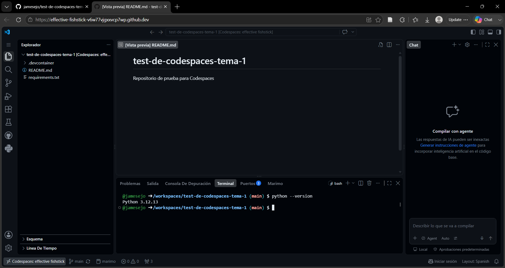
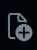

## Ejercicio 1.1

El objetivo de este ejercicio es que el estudiante cree su propia cuenta en **GitHub** y complete el proceso de solicitud del **GitHub Student Developer Pack**. El GitHub Student Developer Pack ofrece acceso gratuito a herramientas profesionales de desarrollo: dominios, servidores, IDEs, créditos en la nube, herramientas de diseño, bases de datos y mucho más.

A continuación las instrucciones, paso a paso, que debes seguir para completar este ejercicio.

::: {.callout-note title="1 - Crear una cuenta en GitHub" collapse="true"}

- **Paso 1:** Entra en: [**https://github.com/**](https://github.com/){target="_blank" rel="noopener noreferrer"}

- **Paso 2:** Iniciar el registro. Haz clic en **Sign up** (arriba a la derecha).

- **Paso 3:** Introducir tus datos. GitHub te pedirá:

    - **Correo electrónico** (usa tu correo universitario de la UIB).
    - **Contraseña** segura.
    - **Nombre de usuario** (será tu identidad pública en GitHub).

- **Paso 4:** Verificar tu correo. GitHub enviará un mensaje a tu email de la UIB. Abre el correo y pulsa **Verify email address**.

:::

::: {.callout-note title="2 - Completar tu perfil" collapse="true"}

Una vez creada la cuenta, completa tu perfil de usuario siguiendo estos pasos:

- **Paso 1:** Accede a tu perfil. Haz clic en tu foto o avatar (arriba a la derecha) y selecciona **Your profile**.

- **Paso 2:** Haz clic en **Edit profile** y completa la información solicitada:

    - **Name** → Tu nombre real.
    - **Bio** → Una breve descripción (por ejemplo: *Estudiante del Grado en Matemáticas (UIB)*).
    - **Company** → Aquí es donde se indica la **Universidad**. Ejemplo: `Universitat de les Illes Balears`

- **Paso 3:** Guardar los cambios haciendo clic en **Save** al final del formulario.

Tras completar estos pasos, tendrás un **perfil académico básico y correcto**, adecuado para solicitar el **GitHub Student Developer Pack**

:::

::: {.callout-note title="3 - Activar la autenticación en dos pasos (2FA)" collapse="true"}

- **Paso 1:** Accede a la configuración de tu cuenta. Haz clic en tu foto o avatar (arriba a la derecha) y selecciona **Settings**.

- **Paso 2:** En el menú lateral izquierdo, abrir la sección **Password and authentication**.

- **Paso 3:** Dentro de **Password and authentication**, localizar el apartado **Two-factor authentication → Enable two-factor authentication**

- **Paso 4:** Elegir el método de autenticación.

    - Se recomienda emplear una aplicación de autenticación (Authenticator app). 
    - Dado que la UIB requiere la aplicación **Microsoft Authenticator** se sugiere utilizar esta.
    - Debes:

    1. Abrir la aplicación **Microsoft Authenticator** en tu móvil.
    2. Escanear el **código QR** que aparece en pantalla.
    3. Tocar el ícono de GitHub en la app (en tu móvil) para ver el **código temporal** de 6 dígitos que se genera cada 30 segundos. 
    4. Introducir el **código temporal** anterior en la página de GitHub.

:::

::: {.callout-note title="4 - Reportar la cuenta de GitHub en el Aula Digital" collapse="true"}


:::

::: {.callout-note title="5 - Solicitar el GitHub Student Developer Pack" collapse="true"}

- **Paso 1:** Ve a [**https://education.github.com/pack**](https://education.github.com/pack){target="_blank" rel="noopener noreferrer"}. Haz clic en **Sign up for Student Developer Pack**.

- **Paso 2:** Iniciar sesión con tu cuenta de GitHub. Si no lo has hecho ya, GitHub te pedirá iniciar sesión.

- **Paso 3:** Verificación de identidad académica. GitHub te pedirá demostrar que eres estudiante. Puedes hacerlo de dos formas pero se recomienda la opción de **correo institucional** (el que es xxxxx@estudiant.uib.cat)

- **Paso 4:** Completar el formulario. GitHub te preguntará:

    - Tu **nivel educativo** (Undergraduate)
    - Tu **universidad**
    - Tu **motivo para solicitar el Pack** (puedes escribir algo sencillo como: *“I want to use professional development tools for my university degree programming projects.”*)

- **Paso 5:** Enviar la solicitud. Clic en **Submit**.

GitHub suele tardar entre **1 y 5 días** en revisar la solicitud. Recibirás un correo indicando si ha sido aprobada. Una vez aceptado, tendrás acceso a todas las herramientas del Pack desde tu cuenta de GitHub.

:::

## Ejercicio 1.2

Este ejercicio tiene como objetivo que aprendas a:

1. Crear un repositorio en GitHub.  
2. Configurarlo mínimamente.  
3. Levantar un Codespace asociado a ese repositorio.

::: {#imp-codespace .callout-important title="Repositorio y Codespace"}
Un **repositorio de GitHub** es un espacio donde se guarda un proyecto: contiene el código, archivos del proyecto y el historial de revisiones (commits) que permiten seguir y recuperar cambios a lo largo del tiempo.

Los repositorios pueden ser públicos o privados, soportan ramas y colaboraciones (pull requests, issues) para coordinar trabajo en equipo, y actúan como la unidad básica de trabajo dentro de GitHub.

Un **GitHub Codespace** es un entorno de desarrollo en la nube, listo para usar, que te permite programar directamente desde GitHub sin configurar tu máquina local. Suele venir con herramientas y dependencias preconfiguradas para un repositorio concreto, lo que facilita empezar a trabajar rápido.
:::

::: {.callout-note title="1 - Acceder a tu cuenta de GitHub (si no lo has hecho ya)" collapse="true"}

- Abrir el navegador.  
- Ir a: `https://github.com/`  
- Pulsar **Sign in**.  
- Introducir usuario y contraseña.

:::

::: {.callout-note title="2 - Crear el repositorio `t01-fundamentos`" collapse="true"}

- **Paso 1:** En la parte superior izquierda, hacer clic en `+` ({width="50px"}).

- **Paso 2:** Seleccionar **New repository**.

- **Paso 3:** Aparecerá un formulario con varios campos para configurar el repositorio:

    - **Repository name** → `t01-fundamentos`
    - **Description** → `Repositorio de prueba para Codespaces`
    - **Visibility** → `Private` (privado)
    - **Initialize this repository with a README** → marcar esta opción a On.

- **Paso 4:** Hacer clic en el botón **Create repository**.

- **Paso 5:** Verificar que el repositorio se ha creado. Debes ver una página con:

    - El nombre del repositorio que has dado arriba.  
    - Un archivo `README.md` ya creado.  
    - Un menú con pestañas como *Code*, *Issues*, *Pull requests*, etc.

:::

::: {.callout-note title="3 - Crear un Codespace preconfigurado para Python" collapse="true"}

- **Paso 1:** Crear la carpeta `.devcontainer` y el fichero `devcontainer.json` 

    1. En el repositorio creado (`t01-fundamentos`), hacer clic en el botón **Add file → Create new file**.

    2. En el campo **Name your file** escribir: 

        ```json
        .devcontainer/devcontainer.json
        ```
    3. Dentro del archivo, pega este contenido:

        ```json
        {
            "name": "UIB 23200 - Plantilla de ejercicios (Python 3.13)",

            "image": "mcr.microsoft.com/devcontainers/python:1-3.13-bookworm",

            "features": {
                "ghcr.io/devcontainers-extra/features/uv:1": {},
                "ghcr.io/devcontainers/features/github-cli:1": {}
            },

            "customizations": {
                "vscode": {
                    "extensions": [
                        "ms-python.python",
                        "ms-python.vscode-pylance",
                        "charliermarsh.ruff",
                        "GitHub.copilot",
                        "GitHub.copilot-chat",
                        "marimo-team.vscode-marimo",
                        "oderwat.indent-rainbow"
                    ],

                    "settings": {
                        "python.defaultInterpreterPath": "${containerWorkspaceFolder}/.venv/bin/python",
                        "marimo.pythonPath": "${containerWorkspaceFolder}/.venv/bin/python"
                    }
                }
            },

            "postCreateCommand": "uv sync",
            "updateContentCommand": "uv sync",

            "containerEnv": {
                "UV_CACHE_DIR": "/home/vscode/.cache/uv"
            },
            
            "forwardPorts": [2718],
            "portsAttributes": {
                "2718": {
                    "label": "Marimo",
                    "onAutoForward": "openPreview"
                }
            },

            "remoteUser": "vscode"
        }

        ```

    4. Guardar el archivo: Has clic en **Commit changes...**.

    5. Acepta el mensaje por defecto sobre los cambios y haz clic en **Commit changes**.

- **Paso 2:** Crear el fichero `pyproject.toml` en el directorio raíz del repositorio

    1. Dado el paso anterior puede ocurrir que te encuentres en el directorio `.devcontainer`, **debes ir al directorio raíz del repositorio**, no permanecer dentro de `.devcontainer`. Para ello haz clic en `..` (arriba a la izquierda) para volver al directorio raíz.

    2. En el directorio raíz del repositorio (`t01-fundamentos`), hacer clic en el botón **Add file → Create new file**. 

    2. En el campo **Name your file** escribir: 

        ```json
        pyproject.toml
        ```
    3. Dentro del archivo, pega este contenido:

        ```json
        [project]
        name = "programacion23200"
        version = "1.0.0"
        description = "Repositorio plantilla para la asignatura Programación 23200"
        readme = "README.md"
        requires-python = ">=3.13,<3.14"
        license = "MIT"
        authors = [
            { name = "Universitat de les Illes Balears" }
        ]

        dependencies = [
            "marimo>=0.16"
        ]

        ###############################################################################
        # uv
        ###############################################################################
        #
        # El repositorio no es un paquete instalable: `uv sync` solo instala las
        # dependencias y no intenta construir el proyecto. Por eso no hay sección
        # [build-system] ni configuración de setuptools. El código de src/ es
        # accesible desde los tests gracias a `pythonpath = ["src"]` en pytest.

        [tool.uv]
        package = false

        ###############################################################################
        # Dependency groups
        ###############################################################################

        [dependency-groups]

        #
        # Herramientas de desarrollo (se instalan con `uv sync`)
        #
        dev = [
            "pytest>=8.4",
            "pytest-cov>=6.2",
            "ruff>=0.12",
        ]

        #
        # Ecosistema científico (se instalan con `uv sync --group scientific`)
        #
        scientific = [
            "numpy>=2.3",
            "scipy>=1.16",
            "sympy>=1.14",
            "matplotlib>=3.10",
        ]

        #
        # Manipulación de datos (se instalan con `uv sync --all-groups`)
        #
        data = [
            "pandas>=2.3",
        ]

        ###############################################################################
        # Pytest
        ###############################################################################

        [tool.pytest.ini_options]
        minversion = "8.0"
        testpaths = ["tests"]
        pythonpath = ["src"]
        addopts = [
            "-ra",
        ]

        ###############################################################################
        # Ruff
        ###############################################################################

        [tool.ruff]
        target-version = "py313"
        line-length = 88
        # notebooks/ y ejercicios_simples/ contienen prosa pedagógica (enunciados
        # largos) y variables/código intencionalmente "sueltos" (sin relación de
        # imports, sin uso posterior). Ruff está pensado para src/, no para eso.
        extend-exclude = ["notebooks", "ejercicios_simples"]

        [tool.ruff.lint]
        select = [
            "E",   # pycodestyle errores
            "F",   # pyflakes
            "I",   # isort
            "W",   # pycodestyle advertencias
        ]

        [tool.ruff.format]
        quote-style = "double"
        indent-style = "space"
        line-ending = "lf"

        ###############################################################################
        # Coverage
        ###############################################################################

        [tool.coverage.run]
        source = ["src"]

        [tool.coverage.report]
        show_missing = true
        skip_covered = false
        ```
    4. Guardar el archivo: Has clic en **Commit changes...**.

    5. Acepta el mensaje por defecto sobre los cambios y haz clic en **Commit changes**.

:::

::: {.callout-note title="4 - Arrancar el Codespace" collapse="true"}

- **Paso 1:** Has clic en **Code → Codespaces**. 

- **Paso 2:** Has clic en **Create codespace on main**.

    GitHub detectará el `.devcontainer` y:

    - descargará la imagen de Python,  
    - instalará las extensiones,  
    - configurará el entorno,  
    - abrirá VS Code con soporte completo para Python.

- **Paso 3:** Espera a que el Codespace esté listo. **Este es un proceso que puede tardar unos minutos.** Verás mensajes como:

    - *Setting up remote connection: [Building codespace...]”*  
    - *Installing dependencies…*

- **Paso 4:** Una vez listo, se cargará en el editor de VS Code el `README.md` que se crea por defecto. 

    - Se desplegará una ventana en la que debes hacer clic en **Confiar en la carpeta y continuar**.
    - Se debe abrir la **TERMINAL** integrada en la parte inferior del editor de VS Code. En ella deben aparecer varios mensajes, posiblemente unos como:

    ```text 
    👋 Welcome to Codespaces! You are on a custom image defined in your devcontainer.json file.

    🔍 To explore VS Code to its fullest, search using the Command Palette (Cmd/Ctrl + Shift + P)
    ```


:::

::: {.callout-note title="5 - Reconocer la interfaz del Codespace (VS Code)" collapse="true"}

El entorno tendrá:

- **`Barra lateral izquierda` (`Activity Bar`)** con:

    - **`Explorador`**, muestra los archivos del proyecto.
    - **`Buscar`**, permite buscar texto en los archivos.
    - **`Control de código fuente`**, permite ver los cambios y hacer commits.
    - **`Ejecución y depuración`**, permite ejecutar y depurar el código.
    - **`Extensiones`**, permite gestionar las extensiones de VS Code. 
- **`Editor de código`** en el centro arriba (aparece abierto el README.md).  
- **`Terminal integrada`** en el centro abajo.  
- **`Barra lateral derecha`** para el **CHAT** con Copilot.

{width="90%"}

Para más información sobre la interfaz de VS Code, puedes consultar: 

- [Learn Visual Studio Code in 15 minutes: 2026 Official Beginner Tutorial](https://www.youtube.com/watch?v=VqCgcpAypFQ){target="_blank" rel="noopener noreferrer"} 
- [Visual Studio Code - User Interface](https://code.visualstudio.com/docs/getstarted/userinterface){target="_blank" rel="noopener noreferrer"}.

:::

::: {.callout-note title="6 - Verificar que Python está configurado" collapse="true"}

En la **`Terminal`** del Codespace tendrás el prompt de la shell, que suele ser algo como:

```bash
(programacion23200) @tu_usuario ➜ /workspaces/t01-fundamentos (main) $
```
donde `tu_usuario` es tu nombre de usuario de GitHub.

Escribe el siguiente comando después del signo `$` para comprobar la versión de Python instalada (si copias y pegas el comando, probablemente debas dar permiso en la ventana emergente del navegador para poder pegar texto en la terminal):

```json
python --version
```

Debe aparecer:

```text
Python 3.13.5
```

:::

::: {.callout-note title="7 - Crear un archivo de prueba y ejecutarlo" collapse="true"}

1. En el **`Explorador`**, pulsar **New File** o **Nuevo archivo** ({width="30px"}).  

2. Nombrarlo:  
   ```text
   prueba.py
   ```

3. Escribir dentro:

   ```python
   print("Mi primer Codespace funciona correctamente")
   ```

4. Guardar (`Ctrl + S`).

5. Ejecutar el archivo. 

    - Variante 1: Escribir en la terminal:

    ```text
    python prueba.py
    ```

    - Variante 2: Hacer clic en **Ejecutar archivo de Python** (triángulo de play arriba a la derecha del editor de código).

:::

::: {.callout-note title="8 - Cerrar el Codespace" collapse="true"}

**Este es un paso sumamente importante**. Cuando termines de trabajar en el Codespace, debes cerrarlo para liberar recursos y evitar que se acumulen cargos en tu cuenta de GitHub. **Principalmente ya que el número de horas de Codespaces gratuitas es limitado.**

1. Sin salir del Codespace:

    - Presiona `Ctrl + Shift + P` (o `Cmd + Shift + P` en Mac) para abrir la paleta de comandos.
    - Escribe `Codespaces: Close Codespace` y selecciona la opción que aparece.

2. Alternativamente, puedes cerrar el Codespace desde tu sitio de GitHub:

    - Ve a tu repositorio en GitHub.
    - Haz clic en **Code → Codespaces**.
    - Localiza el Codespace que quieres cerrar y haz clic en **... → Stop Codespace**.

:::