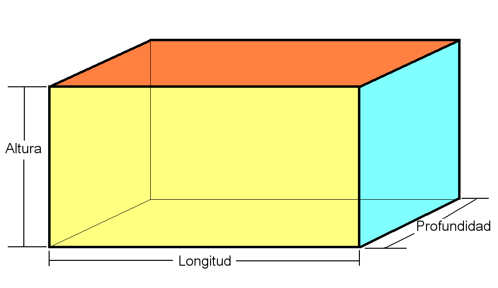

Para la realización de los ejercicios debe utilizar el proyecto de ejemplo `t03_ejemplo` que está disponible en el repositorio del curso: [https://github.com/UIB-23200-Programacion/t03_ejemplo](https://github.com/UIB-23200-Programacion/t03_ejemplo){target="_blank"}. Navega al sitio y sigue las instrucciones en `README.md` para copiar el repositorio en tu entorno local de GitHub.

Agrega las siguientes funciones al módulo que se especifica del paquete `t03_paquete` contenido en el proyecto respetando las siguientes reglas siempre:

- la función debe contener type hints, docstrings y precondiciones, 
- si la precondición (o alguna de las precondiciones) no se cumple la función debe retornar `None`,
- Al bloque `if __name__ == "__main__"` del módulo se deben agregar pruebas para validar el comportamiento de cada función. Se deben realizar las pruebas al menos para un caso normal y un caso límite (de existir).

## Ejercicio 1: Módulo `numeros.py`

### 1.1 Función `es_perfecto(n)`: 

Retorna `True` si el entero positivo `n` es un número **perfecto** y `False` en caso contrario. Un número es perfecto si es igual a la suma de sus divisores propios (divisores distintos de él mismo). Por ejemplo, $6 = 1 + 2 + 3$.

### 1.2. Función `siguiente_primo(n)`: 

Devuelve el menor primo estrictamente mayor que `n`. Reutiliza `es_primo` del módulo `numeros.py`.

### 1.3. Función `collatz_tstime(n)`: 

Devuelve el número de pasos (**t**otal **s**topping **time**) que tarda la **conjetura de Collatz** en llegar a 1 para un entero positivo `n`. La conjetura establece que, dado un número entero positivo `n`, si es par se divide entre 2 y si es impar se multiplica por 3 y se le suma 1. Se repite el proceso hasta llegar a 1. Vea ejercicio 27 del tema 2 para más detalles.

### 1.4. Función `collatz_max(n)`: 

Devuelve el valor máximo alcanzado durante la secuencia de la conjetura de Collatz para un entero positivo `n`. Vea ejercicio 27 del tema 2 para más detalles.

### 1.5. Función `p_fibonacci(n, p)`: 

Devuelve el n-ésimo número de la secuencia $p$-Fibonacci. La secuencia  $p$-Fibonacci, para $p \in \mathbb{Z}$ con $p > 0$ se define mediante la siguiente relación de recurrencia: 
$$
\begin{aligned}
F_p(0) &= 0, \\
F_p(1) &= 1, \\
F_p(n) &= F_p(n-1) + F_p(n-2), \quad n \geq 2.
\end{aligned}
$$
Cuando $p=1$ se obtiene la secuencia de Fibonacci clásica. Cuando $p=2$ se obtiene la secuencia de Pell cuyos términos son: 
$$
0, 1, 2, 5, 12, 29, 70, 169, 408, 985, 2378, 5741, 13860, ...
$$
Por ejemplo, `p_fibonacci(5, 2)` devuelve el quinto término de la secuencia de Pell, que es 12. En esta función $p$ debe ser un parámetro con valor por defecto de 1 (produce la secuencia de Fibonacci clásica). 

### 1.6. Función `phi_euler(n)`: 

Devuelve el valor de la función totiente de Euler $\phi(n)$ para un entero positivo `n`. La función $\phi(n)$ se define como el número de enteros positivos menores o iguales a `n` que son coprimos con `n`. Dos números $m$ y $n$ son coprimos si $\text{mcd}(m, n) = 1$. Por ejemplo, $\phi(9) = 6$ porque los enteros positivos menores o iguales a 9 que son coprimos con 9 son: 1, 2, 4, 5, 7 y 8.

### 1.7. Función `tau(n)`: 

Devuelve el número de divisores positivos de un entero positivo `n`. Por ejemplo, `tau(12)` devuelve 6 porque los divisores positivos de 12 son: 1, 2, 3, 4, 6 y 12.

### 1.8. Función `sigma(n)`: 

Devuelve la suma de los divisores positivos de un entero positivo `n`. Por ejemplo, `sigma(12)` devuelve 28 porque los divisores positivos de 12 son: 1, 2, 3, 4, 6 y 12 y su suma es $1 + 2 + 3 + 4 + 6 + 12 = 28$.

### 1.9. Función `exponenciacion_rapida(a, n)`: 

Devuelve el valor de $a^n$ utilizando el algoritmo de **exponenciación rápida**. La **exponenciación rápida** (*fast exponentiation* o *exponentiation by squaring*) es un algoritmo para calcular $a^n$ en $O(\log n)$ multiplicaciones en lugar de las $O(n)$ del método ingenuo.

Se basa en la observación:
$$
a^n = \begin{cases}
1 & \text{si } n = 0 \\
\left(a^{n/2}\right)^2 & \text{si } n \text{ es par} \\
a \cdot \left(a^{(n-1)/2}\right)^2 & \text{si } n \text{ es impar}
\end{cases}
$$
En lugar de multiplicar $a$ por sí mismo $n$ veces, cada paso **divide el exponente a la mitad**, reduciendo el problema de tamaño $n$ a uno de tamaño $n/2$. Por ejemplo, para calcular $2^{10}$ solo se necesitan 4 multiplicaciones en lugar de 9. La ganancia crece con el exponente: $a^{1000}$ requiere 10 multiplicaciones en lugar de 999. 

**La implementación recursiva de esta función es directa y elegante**.

### 1.10. Función `exponenciacion_modular(a, n, m)`:

La **exponenciación modular rápida** es la combinación de la exponenciación rápida con aritmética modular: calcula $a^n \bmod m$ de forma eficiente. Es el algoritmo central de la criptografía moderna —RSA, Diffie-Hellman, pruebas de primalidad— porque en esos contextos se necesita calcular potencias con exponentes de cientos de dígitos, pero solo interesa el resto módulo un número grande.

La clave es que el módulo puede aplicarse en **cada paso intermedio**, sin esperar al resultado final. Esto se justifica por la propiedad:
$$
(a \cdot b) \bmod m = \bigl((a \bmod m) \cdot (b \bmod m)\bigr) \bmod m
$$
Esto evita que los números intermedios crezcan sin control: aunque $a^n$ pueda tener millones de dígitos, todos los valores intermedios permanecen en $\{0, 1, \ldots, m-1\}$.

La recurrencia es idéntica a la exponenciación rápida, añadiendo `% m` en cada operación:
$$
a^n \bmod m = \begin{cases}
1 & \text{si } n = 0 \\
\left(a^{n/2} \bmod m\right)^2 \bmod m & \text{si } n \text{ es par} \\
a \cdot \left(a^{(n-1)/2} \bmod m\right)^2 \bmod m & \text{si } n \text{ es impar}
\end{cases}
$$

## Ejercicio 2: Módulo `geometria.py`

### 2.1 Función `area_elipse(a, b)`:

Calcula el área de una elipse a partir de la longitud de sus semiejes `a` y `b` mediante la fórmula:
$$
A = \pi \cdot a \cdot b.
$$
Se debe verificar que ambos semiejes sean reales positivos.

### 2.2 Función `area_triangulo(a, b, c)`:

Calcula el área de un triángulo a partir de la longitud de sus lados `a`, `b` y `c` utilizando la fórmula de Herón:
$$
A = \sqrt{s(s-a)(s-b)(s-c)}
$$
donde $s = \frac{a+b+c}{2}$ es el semiperímetro. Reutiliza `es_triangulo_valido` para validar que los lados forman un triángulo válido.

### 2.3 Función `area_trapecio(b1, b2, h)`:

Calcula el área de un trapecio a partir de la longitud de sus bases `b1` y `b2` y su altura `h`
$$
A = \frac{(b_1+b_2)}{2} \cdot h.
$$

### 2.4 Función `es_cuadrilatero_valido(a, b, c, d)`:

Verifica si los lados `a`, `b`, `c` y `d` forman un cuadrilátero válido. La condición necesaria y suficiente es la generalización de la desigualdad triangular: **cada lado debe ser menor que la suma de los otros tres**. Equivalentemente, el lado más largo debe ser menor que la suma de los demás:
$$
\max(a, b, c, d) < a + b + c + d - \max(a, b, c, d),
$$
que simplifica a:
$$
2\max(a, b, c, d) < a + b + c + d.
$$
Obviamente se debe verificar además que todos los lados sean positivos. Recuerde que en Python la función built-in `max` puede recibir un número arbitrario de argumentos: `max(a, b, c, d)`.

### 2.5 Función `area_maxima_cuadrilatero(a, b, c, d)`:

Calcula el área máxima posible de un cuadrilátero de lados $a, b, c, d$ correspondiente al cuadrilátero cíclico (inscrito en una circunferencia), mediante la fórmula de Brahmagupta que generaliza la de Herón:
$$
A = \sqrt{(s-a)(s-b)(s-c)(s-d)}
$$
donde $s = \dfrac{a+b+c+d}{2}$ es el semiperímetro. Observa que cuando $d = 0$ se recupera exactamente la fórmula de Herón. Reutiliza `es_cuadrilatero_valido` para validar que los lados forman un cuadrilátero válido.

### 2.6 Función `area_poligono_regular(n, l)`:

Calcula el área de un polígono regular de $n$ lados y longitud de lado $l$ mediante la fórmula:
$$
A = \frac{n \cdot l^2}{4 \cdot \tan\left(\frac{\pi}{n}\right)}.
$$
Se debe verificar que $n \geq 3$ y $l > 0$. La función `math.tan` devuelve el valor de la tangente de un ángulo dado en radianes.

### 2.7 Función `es_cuadrado(l, r, d, u)`:

Esta función se puede emplear en el problema [Draw a Square](https://codeforces.com/problemset/problem/2074/A){target="_blank"} de [Codeforces](https://codeforces.com/){target="_blank"}. La traducción de parte del enunciado es la siguiente:

> Los soldados Rosa te han dado 4 puntos distintos en el plano. Las coordenadas de los 4 puntos son $(−l,0)$, $(r,0)$, $(0,−d)$, $(0,u)$ respectivamente, donde $l, r, d, u$ son enteros positivos. Determina si es posible dibujar un cuadrado con los puntos dados como vértices.

La función `es_cuadrado(l, r, d, u)` debe retornar `True` si es posible dibujar un cuadrado con los puntos dados como vértices y `False` en caso contrario.

**Ejemplos:**

```python
print(es_cuadrado(1, 1, 1, 1))  # True
print(es_cuadrado(1, 2, 1, 1))  # False
print(es_cuadrado(1, 2, 3, 4))  # False
```

### 2.8 Función `make_a_triangle(a, b, c)`:

Esta función se puede emplear en el problema [Make a Triangle!](https://codeforces.com/contest/1064/problem/A){target="_blank"} de [Codeforces](https://codeforces.com/){target="_blank"}. La traducción de parte del enunciado es la siguiente:

> Masha tiene tres palos de longitudes $a$, $b$ y $c$ centímetros respectivamente. En un minuto, Masha puede elegir un palo arbitrario y aumentar su longitud en un centímetro. No le está permitido romper palos. ¿Cuál es el número mínimo de minutos que necesita dedicar a aumentar la longitud de un palo para poder ensamblar un triángulo de área positiva? Los palos deben usarse como lados del triángulo (un palo por lado) y sus extremos deben situarse en los vértices del triángulo. Se cumple que $a, b, c$ enteros con $1 \leq a, b, c \leq 100$.

La función `make_a_triangle(a, b, c)` debe calcular el número mínimo de minutos (un entero no negativo) que Masha necesita para poder formar el triángulo de área positiva con sus bastones.

**Ejemplos:**

```python
print(make_a_triangle(3, 4, 5))      # 0
print(make_a_triangle(2, 5, 3))      # 1
print(make_a_triangle(100, 10, 10))  # 81
```

### 2.9 Función `perimetro_minimo(n)`:

Esta función se puede emplear en el problema [Lazy Security Guard](https://codeforces.com/contest/859/problem/B){target="_blank"} de [Codeforces](https://codeforces.com/){target="_blank"}. La traducción de parte del enunciado es la siguiente:

> Tu amigo guardia de seguridad consiguió recientemente un nuevo trabajo en una nueva empresa de seguridad. La compañía le exige patrullar una zona de la ciudad que abarca exactamente $n$ manzanas, pero le dejan elegir cuáles manzanas. Es decir, tu amigo debe recorrer el perímetro de una región cuya superficie es exactamente $n$ bloques cuadrados. Tu amigo es bastante vago y le gustaría que le ayudaras a encontrar la ruta más corta posible que cumpla con los requisitos. La ciudad está dispuesta en un patrón de cuadrícula y es lo suficientemente grande como para que, a efectos del problema, pueda considerarse infinita.

La entrada consistirá en un solo entero $n$ ($1 \leq n \leq 10^6$), el número de manzanas que deben estar delimitadas por la ruta. Debe retorna el perímetro mínimo que se pueda alcanzar. Las manzanas se consideran cuadrados de lado 1.

**Ejemplos:**

```python
print(perimetro_minimo(4))   # 8
print(perimetro_minimo(11))  # 14
print(perimetro_minimo(22))  # 20
```

**Pista:**

Para cualquier región conexa de área $n$ en una cuadrícula, el perímetro mínimo alcanzable es exactamente $2 \lceil 2\sqrt{n} \rceil$. Las regiones que logran este mínimo son configuraciones compactas que siempre pueden inscribirse dentro de una caja delimitadora de dimensiones $k \times k$, $k \times (k+1)$ o $(k+1) \times (k+1)$, donde $k = \lfloor \sqrt{n} \rfloor$. Las funciones `math.floor` y `math.ceil` devuelven el piso ($\lfloor x \rfloor$) y el techo de un número real ($\lceil x \rceil$), respectivamente.

### 2.10 Función `ortoedro(l, m, n)`:

Esta función se puede emplear en el problema [Parallelepiped](https://codeforces.com/contest/224/problem/A){target="_blank"} de [Codeforces](https://codeforces.com/){target="_blank"}. La traducción de parte del enunciado es la siguiente:

> Tienes un paralelepípedo rectangular (ortoedro) con aristas de longitudes enteras. Conoces las áreas de sus tres caras que tienen un vértice común. Tu tarea es encontrar la suma de las longitudes de las 12 aristas de este paralelepípedo.

{#fig-ortoedro width=90%}

La función recibe tres enteros positivos `l`, `m` y `n` que representan las áreas de las tres caras que comparten un vértice común. Debe retornar la suma de las longitudes de las 12 aristas del paralelepípedo.

***Ejemplos:**

```python
print(ortoedro(1, 1, 1))  # 12
print(ortoedro(4, 6, 6))  # 28
```

**Pista:**

Sean $a, b, c$ las aristas (altura, longitud y profundidad) y $l = ab$, $m = bc$, $n = ac$ las tres áreas conocidas. Los productos cruzados eliminan la variable no deseada:
$$
l \cdot n = ab \cdot ac = a^2 bc \implies \frac{l n}{m} = a^2
$$

## Ejercicio 3: Módulo `conversor.py`

### 3.1 Función `decimal_a_binario(n)`:

Convierte un número entero positivo `n` a su representación binaria como una cadena de caracteres. Por ejemplo, `decimal_a_binario(10)` devuelve `'1010'`. 

**Pista:**

El algoritmo clásico para convertir un número decimal a binario se conoce como el **método de divisiones sucesivas por 2**. Consiste en dividir el número decimal entre 2 repetidas veces. En cada paso, guardamos el residuo (que siempre será 0 o 1) y continuamos dividiendo el cociente hasta que este llegue a 0. El número binario final se forma leyendo los residuos obtenidos de abajo hacia arriba (es decir, el último residuo es el primer dígito del binario). Por ejemplo, para convertir el número decimal 10 a binario:

- 10 % 2 = 0, 10 ÷ 2 = 5, agregar '0' a binario
- 5 % 2 = 1, 5 ÷ 2 = 2, agregar '1' a binario
- 2 % 2 = 0, 2 ÷ 2 = 1, agregar '0' a binario
- 1 % 2 = 1, 1 ÷ 2 = 0, agregar '1' a binario

### 3.2 Función segundos_a_dhms(s)`

Imprime el número de segundos `s >= 0` en el formato `DD:HH:MM:SS` donde `DD` son los días, `HH` las horas, `MM` los minutos y `SS` los segundos. Usa división entera y módulo exclusivamente. Por ejemplo, `segundos_a_dhms(100000)` imprime `01:03:46:40`. Esta función no retorna ningún valor, solo imprime el resultado en pantalla.

### 3.3 Función `dhms_a_segundos(d, h, m, s)`:

Convierte un tiempo dado en días `d`, horas `h`, minutos `m` y segundos `s` a su equivalente en segundos. Por ejemplo, `dhms_a_segundos(1, 3, 46, 40)` devuelve `100000`.

### 3.4 Representación de fechas con un único entero no negativo:

En informática, representar una fecha con un único número se logra por dos vías fundamentales:

1. Calculando el tiempo transcurrido desde un punto de referencia fijo temporal. A este punto de referencia se le conoce como **Epoch** (o época). El estándar absoluto en programación y sistemas operativos de este método es el **Tiempo Unix**. Representa una fecha como la cantidad de **segundos** (o milisegundos) transcurridos desde el **"Unix Epoch"** que es el **1 de enero de 1970 a las 00:00:00 UTC** (del inglés Coordinated Universal Time).
2. **Formato de Entero Posicional** (YYYYMMDD) muy común en el procesamiento de datos y almacenamiento plano. Consiste en concatenar el año, mes y día en un solo número entero. Por ejemplo, el 7 de septiembre de 2026 se representa como `20260907`. Este formato tiene la ventaja de ser legible por humanos y de mantener el orden cronológico (un número mayor siempre es una fecha posterior), lo que permite ordenamientos muy eficientes sin necesidad de parsear la fecha.

Agrega las siguientes funciones al módulo `conversor.py`:

#### 3.4.1 Función `fecha_a_entero(año, mes, dia)`:

Convierte una fecha dada por año, mes y día a un único número entero no negativo en formato YYYYMMDD. Por ejemplo, `fecha_a_entero(2026, 9, 7)` devuelve `20260907`. Tanto el año como el mes y el día deben ser enteros positivos. El mes debe estar en el rango 1 a 12 y el día debe ser válido para el mes y año dados (considerando años bisiestos).

#### 3.4.2 Función `entero_a_fecha(n)`:

Convierte un número entero no negativo en formato YYYYMMDD a una fecha dada por año, mes y día en el formato DD/MM/AAAA. Por ejemplo, `entero_a_fecha(20260907)` devuelve la cadena `'07/09/2026'`.

#### 3.4.3 Función `entero_a_unix(n)`:

Convierte una fecha dada por `n` en formato de entero posicional YYYYMMDD a Tiempo Unix en segundos. Por ejemplo, `entero_a_unix(20260907)` devuelve `1788739200`. Tanto el año como el mes y el día deben ser enteros positivos. El mes debe estar en el rango 1 a 12 y el día debe ser válido para el mes y año dados (considerando años bisiestos). 

Observe que si la fecha es anterior al 1 de enero de 1970, la función debe retornar un entero negativo. Por ejemplo, `entero_a_unix(19000101)` devuelve `-2208988800`.

#### 3.4.4 Función `unix_a_entero(t)`:

Convierte un entero `t` que representa el Tiempo Unix en segundos a un número entero en formato YYYYMMDD. Por ejemplo, `unix_a_entero(1788739200)` devuelve `20260907` y `unix_a_entero(-2208988800)` devuelve `19000101`. La función debe retornar un entero no negativo.

**Pista:**

A continuación el pseudocódigo de implementaciones para las funciones en 3.4.3 y 3.4.4. Se emplea el [algoritmo de Howard Hinnant](https://howardhinnant.github.io/date_algorithms.html?utm_source=chatgpt.com){target="_blank"} expuesto en las funciones *civil-to-days* y *days-to-civil*.

**Pseudocódigo:**

En el siguiente pseudocódigo, la constante `719468` representa los días transcurridos desde el 1 de marzo del año 0 hasta el 1 de enero de 1970 (el Epoch de Unix).

**De Fecha a Días**

Convierte un año, mes y día en el número de días transcurridos desde el Epoch. Para obtener el Tiempo Unix, el resultado final simplemente se multiplica por $86400$ (los segundos de un día). Observe que el pesudocódico asume entrada de año, mes y día a diferencia de `entero_a_unix(n)` que recibe un entero en formato YYYYMMDD.

```text
FUNCIÓN fecha_a_unix(año, mes, dia):
    // 1. Desplazar el año para que comience en marzo
    SI mes <= 2:
        año_logico = año - 1
    SINO:
        año_logico = año

    SI mes <= 2:
        mes_logico = mes + 9
    SINO:
        mes_logico = mes - 3
        
    // 2. Calcular el periodo de 400 años (Era)
    era = año_logico // 400
    año_en_era = año_logico - (era * 400)
    
    // 3. Calcular el día dentro del año y luego dentro de la Era
    dia_en_año = (153 * mes_logico + 2) // 5 + dia - 1
    dia_en_era = (año_en_era * 365) + (año_en_era // 4) - (año_en_era // 100) + dia_en_año
    
    // 4. Retornar días totales ajustados al Epoch de 1970
    RETORNAR (era * 146097) + dia_en_era - 719468
FIN FUNCIÓN

```

**De Días a Fecha**

Realiza el proceso inverso. Toma los días continuos desde 1970 y reconstruye el año, mes y día exactos.

```text
FUNCIÓN unix_a_fecha(dias_desde_epoch):
    // 1. Reajustar la base sumando los días previos a 1970
    dias_totales = dias_desde_epoch + 719468
    
    // 2. Extraer la Era y el día exacto dentro de esa Era
    era = dias_totales // 146097
    dia_en_era = dias_totales - (era * 146097)
    
    // 3. Reconstruir el año lógico (fórmula que aplica la regla bisiesta)
    año_en_era = (dia_en_era - (dia_en_era // 1460) + (dia_en_era // 36524) - (dia_en_era // 146096)) // 365
    año_logico = año_en_era + (era * 400)
    
    // 4. Reconstruir el mes y el día a partir de los días restantes
    dia_en_año = dia_en_era - (365 * año_en_era + (año_en_era // 4) - (año_en_era // 100))
    mes_logico = (5 * dia_en_año + 2) // 153
    
    dia = dia_en_año - ((153 * mes_logico + 2) // 5) + 1
    
    // 5. Deshacer el desplazamiento de marzo a enero
    SI mes_logico < 10:
        mes = mes_logico + 3
    SINO:
        mes = mes_logico - 9
        
    SI mes <= 2:
        año = año_logico + 1
    SINO:
        año = año_logico
        
    RETORNAR año, mes, dia
FIN FUNCIÓN

```