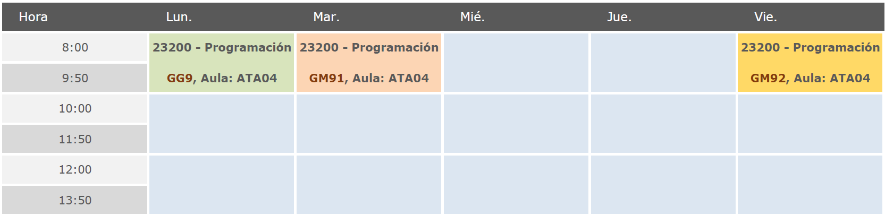
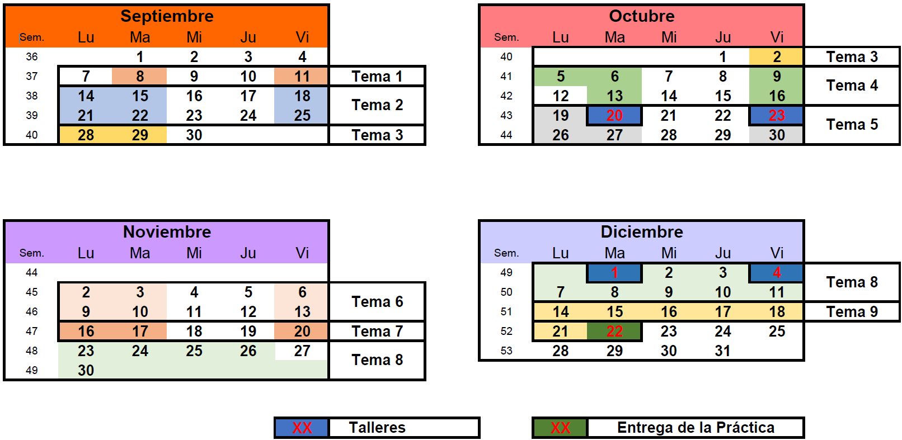

## Calendario de la EPS

El calendario académico de la Escuela Politécnica Superior (EPS) de la Universidad de las Islas Baleares (UIB) para el curso académico 2026-2027 se puede consultar en el siguiente enlace: [https://eps.uib.es/curs-2026-27/](https://eps.uib.es/curs-2026-27/).

---

## Horario de clases

---

## Calendario por temas

---

## Actividades de evaluación

| Actividad | Grupo | Fecha | Peso (\%) | Nota de validación |
| :--- | :--- | :--- | :--- | :--- |
| Examen | GG9 | Enero 2027 | 45\% | 4.5 |
| Primer Taller | GM91 | 20/10/2026 | 12.5\% | - |
| Primer Taller | GM92 | 23/10/2026 | 12.5\% | - |
| Segundo Taller | GM91 | 08/12/2026 | 12.5\% | - |
| Segundo Taller | GM91 | 11/12/2026 | 12.5\% | - |
| Práctica | GG9 | 22/12/2026 | 30\% | 5 |
